# TerraLab3D — Manual d'Operacions i Guia d'Usuari Avançat

> **Edició:** Manual Oficial del Sistema · Format Consola d'Operacions Astronòmiques.  
> **Estat del programari:** Versió viva operativa basada en mòduls científics i renderitzat 3D interactiu.

---

## Índex General de la Consola

- [1. Pròleg i Arquitectura de la Interfície](#1-pròleg-i-arquitectura-de-la-interfície)
- [2. Navegació 3D, Càmera i Modes de Desplaçament](#2-navegació-3d-càmera-i-modes-de-desplaçament)
- [3. 📍 Ubicació de l'Observador i Temps Astronòmic](#3--ubicació-de-lobservador-i-temps-astronòmic)
- [4. 🌌 El Cel: Atmosfera Física, Foscor Bortle i Il·luminació](#4--el-cel-atmosfera-física-foscor-bortle-i-il·luminació)
- [5. 🌌 El Cel: Catàleg Estel·lar Gaia DR3 & Picking d'Inspecció](#5--el-cel-catàleg-estel·lar-gaia-dr3--picking-dinspecció)
- [6. 🌌 El Cel: Sistema Solar — Sol, Lluna 8K, Planetes, Anells i Satèl·lits](#6--el-cel-sistema-solar--sol-lluna-8k-planetes-anells-i-satèl·lits)
- [7. 🌌 El Cel: Via Làctia, Pols Galàctica de Planck i Cel Profund NGC/IC](#7--el-cel-via-làctia-pols-galàctica-de-planck-i-cel-profund-ngcic)
- [8. 🌌 El Cel: Trajectòries de 24h i Visibilitat sobre l'Horitzó Real DEM](#8--el-cel-trajectòries-de-24h-i-visibilitat-sobre-lhoritzó-real-dem)
- [9. 🌌 El Cel: Traces Estel·lars i Exposició Temporal (Star Trails)](#9--el-cel-traces-estel·lars-i-exposició-temporal-star-trails)
- [10. ⛰️ Terra: Relleu DEM 3D, Horitzó Real Calculat i Cobertura de Superfície](#10-️-terra-relleu-dem-3d-horitzó-real-calculat-i-cobertura-de-superfície)
- [11. 📐 Eines: Modes d'Observació Instrumental (Òptica i Fotografia)](#11--eines-modes-dobservació-instrumental-òptica-i-fotografia)
- [12. 📐 Eines: Instruments de Mesura Esfèrica](#12--eines-instruments-de-mesura-esfèrica)
- [13. 🌌 Constel·lacions de referència i figures pròpies](#13--constellacions-de-referència-i-figures-pròpies)
- [Apèndix A — Taula de Dreceres de Teclat i Gestos Ràpids](#apèndix-a--taula-de-draceres-de-teclat-i-gestos-ràpids)
- [Apèndix B — Oracles de Càlcul Científic, Fonts de Dades i Toleràncies](#apèndix-b--oracles-de-càlcul-científic-fonts-de-dades-i-toleràncies)
- [Apèndix C — Preguntes Freqüents i Resolució d'Incidències (FAQ)](#apèndix-c--preguntes-freqüents-i-resolució-dincidències-faq)

---

## 1. Pròleg i Arquitectura de la Interfície

### 1.1. Què és TerraLab3D i per a què serveix

**TerraLab3D** és una estació de treball astronòmica i geogràfica tridimensional dissenyada per a la simulació, observació i anàlisi de la volta celeste en conjunció amb la topografia real de la Terra. A diferència dels planetaris convencionals que utilitzen horitzons plans artificials o fons bidimensionals, TerraLab3D integra models digitals d'elevació (DEM) reals amb càlculs d'efemèrides d'alta precisió (SPICE, DE440, Gaia DR3), permetent conèixer exactament com i quan un astre és visible des de qualsevol punt geogràfic del planeta.

### 1.2. Organització de la consola d'operacions

La interfície s'organitza en quatre àrees funcionals interconnectades en temps real:

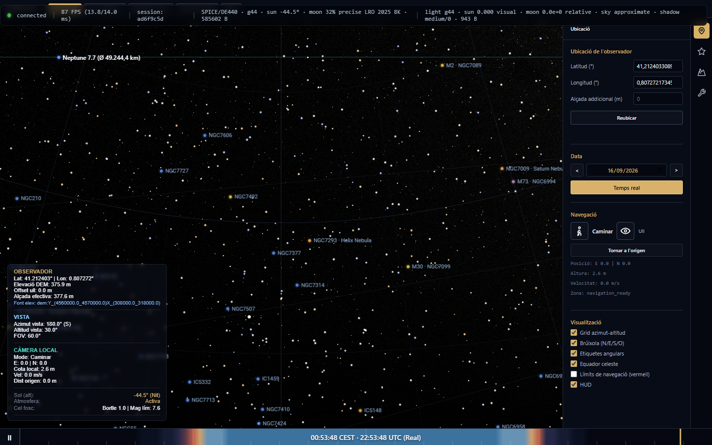

1. **Cúpula Celeste 3D (Espai Central):** Motor de renderitzat interactiu a 360° amb projecció perspectiva esfèrica, malles de terreny DEM d'alta resolució, estrelles Gaia, cossos del Sistema Solar i cel profund.
2. **Calaix de Menús Lateral (Menú d'Eines):** Desplegable amb quatre pestanyes especialitzades:
   - **📍 Ubicació:** Coordenades geodèsiques, elevació de l'observador, offsets d'ull i modes de navegació.
   - **🌌 Cel:** Control de física atmosfèrica, contaminació lumínica Bortle, Sistema Solar, Via Làctia, cel profund i trajectòries.
   - **⛰️ Terra (Topografia):** Gestió de malles DEM, perfil d'horitzó real calculat i cobertures de sòl.
   - **📐 Eines:** Simulació de sensors i òptiques (Ull nu, Càmera, Telescopi) i instruments de mesura esfèrica.
3. **HUD d'Inspecció i Estat (Inferior Esquerre):** Targeta telemètrica amb coordenades de l'observador, orientació de càmera (Az, Alt, FOV) i detall científic de l'astre seleccionat amb botons d'acció ràpida (*Centrar*, *Seguir*, *Alliberar*, *Netejar*).
4. **Línia Temporal de Simulació (Barra Inferior):** Control del rellotge astronòmic, temps universal (UTC), temps sideral local (LST), alçades solars, crepuscles i velocitat de reproducció.

### 1.3. Com funciona per dins

TerraLab3D implementa una arquitectura desacoblada:

- **Nucli Científic (Python):** Executa els models de mecànica celeste, rotació terrestre (IAU/IERS), integració de perfils d'horitzó i mostreig d'efemèrides.
- **Pont de Comunicació (WebSocket):** Transfereix dades d'estat i buffers binaris compactes (`ArrayBuffer`) amb sincronització asíncrona no blocant basada en generacions monotòniques (*latest-wins*).
- **Adaptador Visual (Three.js / WebGL):** Manté geometries retingudes, materials de shaders físics i renderitzat fluid a 60 fps.

**Passos d'origen:** [Pas 1 — Entorn 3D executable](tasques/completat/pas1.md), [Pas 4 — Grid celeste, brúixola i HUD](tasques/completat/pas4.md).

---

## 2. Navegació 3D, Càmera i Modes de Desplaçament

### 2.1. Què fa i per a què serveix

Permet a l'observador moure lliurement la visual per tota l'esfera celeste, desplaçar-se per la topografia del terreny, fer zoom sobre detalls astronòmics i bloquejar el seguiment automàtic de qualsevol cos celeste per compensar la rotació de la Terra.

### 2.2. Com s'utilitza: Comandaments i Gestos

| Comandament | Acció | Descripció operativa |
| :--- | :--- | :--- |
| **Clic esquerre + Arrossegar** | Girar mirada | Varia de forma contínua l'Azimut ($0^\circ \to 360^\circ$) i l'Altitud ($-90^\circ \to +90^\circ$). |
| **Roda del ratolí** | Zoom òptic | Modifica el camp de visió horitzontal ($\text{FOV}$) entre $1^\circ$ (detall planetari) i $100^\circ$ (gran angular). |
| **Clic sobre un astre** | Selecció + Seguiment | Centra l'astre, obre la fitxa al HUD i activa el mode `Seguint ✓`. |
| **Tecla `F`** | Mode Avió | Intercanvia entre Mode Avió i Mode Persona |
| **Tecles `W`, `A`, `S`, `D`** | Desplaçament | Mou la càmera en mode *Caminar* (sobre la cota del terreny) o en mode *Avió*. |
| **Tecla `Esc`** | Alliberar / Reset | Desactiva el seguiment de càmera actiu i retorna al mode d'Ull nu lliure. |

#### Modes de càmera (Pestanya 📍 Ubicació)

- **Mode Trípode / Ull nu (Fix):** La càmera roman fixa al punt d'observació geogràfic. Rotació pura en azimut i altitud.
- **Mode Caminar (First-person):** L'observador camina pel terreny. El sistema calcula en cada pas la cota del terreny DEM $z_{\text{DEM}}(x, y)$ i hi afegeix l'alçada d'ull (per defecte $1.70\text{ m}$).
- **Mode Avió / Vol lliure:** Desplaçament tridimensional ràpid per explorar carenes i valls amb transicions suaus.

### 2.3. Com funciona per dins: Cinemàtica i Seguiment

La càmera es defineix en coordenades topocèntriques locals **ENU** (*East-North-Up*). La direcció de la visual es calcula mitjançant el vector unitari:
$$\vec{v} = \begin{pmatrix} \cos(\text{alt}) \cdot \sin(\text{az}) \\ \cos(\text{alt}) \cdot \cos(\text{az}) \\ \sin(\text{alt}) \end{pmatrix}$$

Quan s'activa el seguiment (`focusTrackingController.startTracking`), el sistema resol a cada frame la posició topocèntrica de l'objecte objectiu $\vec{P}_{\text{target}}(t)$ i ajusta la matriu de rotació de la càmera mitjançant interpolació esfèrica de quaternions (Slerp), garantint un seguiment suau sense vibracions numèriques.

**Passos d'origen:** [Pas 1 — Càmera 360°](tasques/completat/pas1.md), [Pas 3.5 — Càmera translacional i modes de navegació](tasques/completat/pas3.5.md), [Pas 4 — HUD](tasques/completat/pas4.md), [Pas 12 — Cerca i seguiment](tasques/completat/pas12.md).

---

## 3. 📍 Ubicació de l'Observador i Temps Astronòmic

### 3.1. Què fa i per a què serveix

Defineix les coordenades geodèsiques i l'instant temporal exacte de la simulació. Permet situar l'observador a qualsevol punt de la superfície de la Terra i analitzar el cel en qualsevol data del passat o del futur amb màxima precisió sideral.

### 3.2. Com s'utilitza

1. Obriu la pestanya **📍 Ubicació** a la barra lateral.
2. Introduïu la **Latitud** (de $-90^\circ$ a $+90^\circ$) i la **Longitud** (de $-180^\circ$ a $+180^\circ$) en graus decimals.
3. El sistema obté automàticament l'elevació del terreny des del model DEM. Podeu afegir una **Alçada addicional** (alçada d'ull o torre d'observació).
4. A la línia temporal inferior, ajusteu l'hora amb la barra lliscant, activeu el mode **Temps real** o canvieu de data amb el calendari.
5. Activeu les caselles d'**Equador celeste**, **Grid azimut-altitud** o **Brúixola** per visualitzar les referències esfèriques.

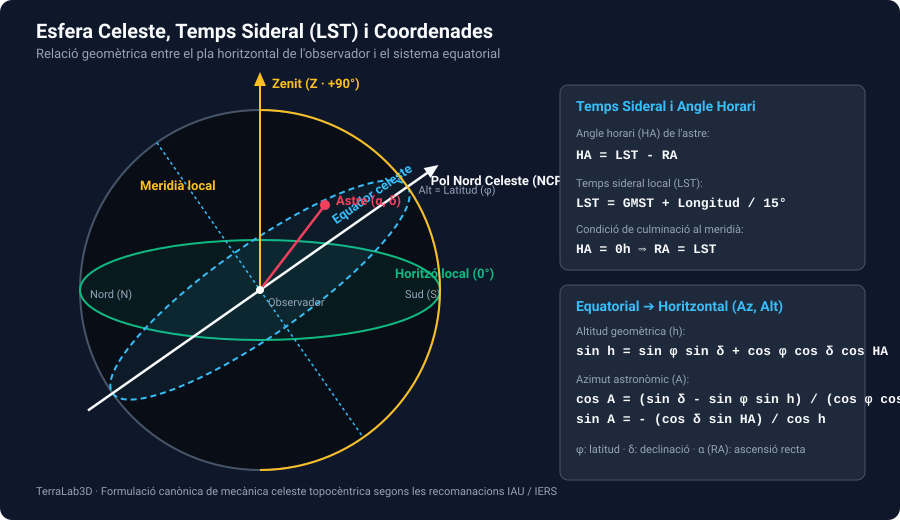

### 3.3. Com funciona per dins: Formulació Matemàtica

#### 1. Dia Julià ($JD$) i Segles Julians ($T$)

El temps universal coordinat ($UT$) es converteix en Dia Julià segons l'algorisme estàndard d'IAU/SOFA:
$$JD = \lfloor 365.25(Y+4716) \rfloor + \lfloor 30.6001(M+1) \rfloor + D + \frac{h + m/60 + s/3600}{24} + B - 1524.5$$
on $B = 2 - \lfloor Y/100 \rfloor + \lfloor Y/400 \rfloor$ per a dates gregorianes. El temps en segles julians des de l'època estàndard J2000.0 és:
$$T = \frac{JD - 2451545.0}{36525}$$

#### 2. Temps Sideral de Greenwich ($GMST$) i Local ($LST$)

Segons el model IAU, el Temps Sideral Mitjà de Greenwich a $0\text{h } UT$ es calcula com:
$$\theta_{GMST} = 280.46061837^\circ + 360.98564736629^\circ \cdot (JD - 2451545.0) + 0.000387933^\circ \cdot T^2 - \frac{T^3}{38710000}^\circ$$
El **Temps Sideral Local ($LST$)** a la longitud geogràfica $\lambda$ de l'observador s'obté sumant la longitud en unitats angulars:
$$LST = \left( \theta_{GMST} + \lambda \right) \pmod{360^\circ}$$

#### 3. Conversió de Coordenades Equatorials (ICRS) a Horitzontals Locals (ENU)

Donat un astre amb Ascensió Recta $\alpha$ i Declinació $\delta$, el seu **Angle Horari ($HA$)** és:
$$HA = LST - \alpha$$
L'**Altitud geomètrica ($h$)** i l'**Azimut astronòmic ($A$)** s'obtenen resolent el triangle astronòmic:
$$\sin h = \sin \phi \cdot \sin \delta + \cos \phi \cdot \cos \delta \cdot \cos HA$$
$$\cos A = \frac{\sin \delta - \sin \phi \cdot \sin h}{\cos \phi \cdot \cos h}, \quad \sin A = -\frac{\cos \delta \cdot \sin HA}{\cos h}$$
on $\phi$ és la latitud geogràfica de l'observador.

**Passos d'origen:** [Pas 2 — Ubicació geogràfica](tasques/completat/pas2.md), [Pas 3 — Rellotge de simulació i temps sideral](tasques/completat/pas3.md), [Pas 4 — Grid celeste i brúixola](tasques/completat/pas4.md).

---

## 4. 🌌 El Cel: Atmosfera Física, Foscor Bortle i Il·luminació

### 4.1. Què fa i per a què serveix

Simula la interacció de la llum solar i lunar amb l'atmosfera terrestre (dispersió de Rayleigh i Mie), reproduint amb fidelitat física el blau del cel diürn, els tons daurats i rogencs de les postes de sol, les fases crepusculars i l'impacte de la contaminació lumínica en la visibilitat de les estrelles.

### 4.2. Com s'utilitza

1. Aneu a la pestanya **🌌 Cel**.
2. **Atmosfera visual:** Activeu la casella *Atmosfera* per activar el càlcul de dispersió continu.
3. **Contaminació lumínica:**
   - Trieu el mode **Bortle** i seleccioneu una classe entre **1** (cel verge de muntanya o reserva astronòmica) i **9** (centre de gran metròpoli).
   - O trieu el mode **Magnitud** per fixar manualment el límit instrumental o visual d'extinció estel·lar (ex: $6.5\text{ mag}$).

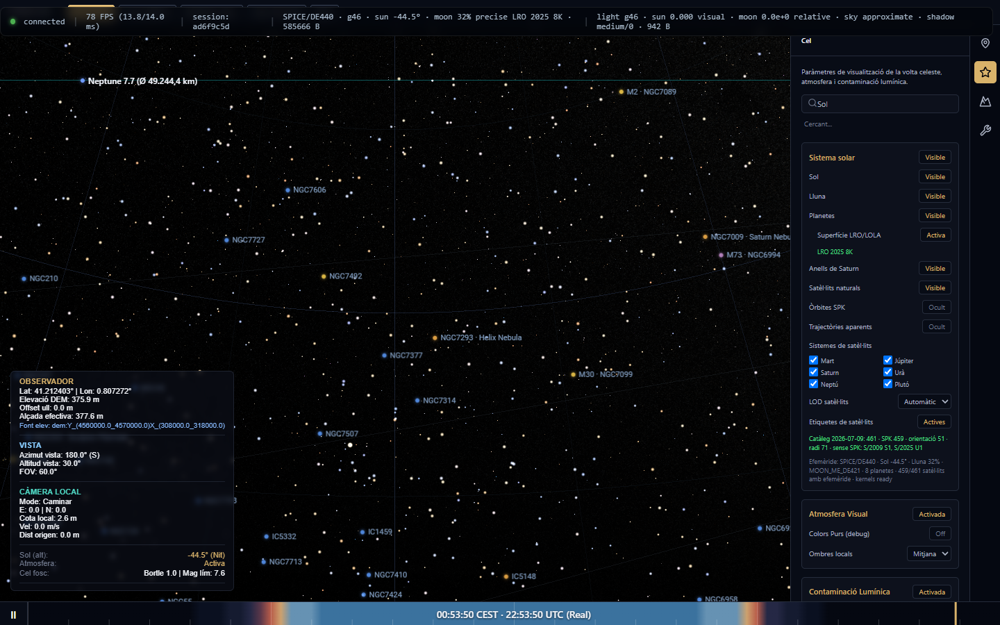

### 4.3. Com funciona per dins: Formulació Matemàtica

#### 1. Fases Crepusculars segons l'Altitud Solar ($h_\odot$)

La il·luminació i el color del cel s'avaluen contínuament en funció de l'altitud del centre del disc solar $h_\odot$:

- **Dia:** $h_\odot > 0^\circ$ (predomini de la dispersió de Rayleigh).
- **Crepuscle Civil:** $-6^\circ < h_\odot \le 0^\circ$ (l'horitzó terrestre és clarament visible; només destaquen Venus, Júpiter i estrelles de primera magnitud com Sírius o Vega).
- **Crepuscle Nàutic:** $-12^\circ < h_\odot \le -6^\circ$ (línia d'horitzó distingible al mar; apareixen les estrelles de navegació de segona magnitud).
- **Crepuscle Astronòmic:** $-18^\circ < h_\odot \le -12^\circ$ (el cel s'enfosqueix progressivament fins a l'extinció de tota llum solar residual).
- **Nit Fosca:** $h_\odot \le -18^\circ$ (la brillantor del cel queda determinada exclusivament per la llum zodiacal, la Lluna i la contaminació lumínica).

#### 2. Escala de Bortle i Magnitud Límit Visual ($m_{\text{lim}}$)

La relació entre la classe de l'escala de Bortle $B \in [1, 9]$ i la **Magnitud Límit Visual d'Ull Nu ($m_{\text{lim}}$)** s'expressa mitjançant el model fotomètric de Schäfer/TerraLab:
$$m_{\text{lim}} = 7.93 - 5 \log_{10}\left(1 + 10^{\frac{B - 1}{2}}\right)$$
La luminància de fons del cel $L_{\text{sky}}$ transmesa al shader en $\text{cd/m}^2$ s'utilitza com a llindar de tall en el renderitzat de punts estel·lars, atenuant o ocultant automàticament les estrelles la brillantor de les quals quedi per sota del fons contaminant.

**Passos d'origen:** [Pas 7 — Cel, atmosfera i Bortle](tasques/completat/pas7.md), [Pas 8.7 — Il·luminació física](tasques/completat/pas8.7.md).

---

## 5. 🌌 El Cel: Catàleg Estel·lar Gaia DR3 & Picking d'Inspecció

### 5.1. Què fa i per a què serveix

Projecta milions d'estrelles procedents del catàleg astromètric **Gaia DR3** de l'Agència Espacial Europea (ESA), calculant per a cadascuna la posició exacta, la magnitud aparent fotomètrica i el color real de cos negre basat en la temperatura efectiva. Permet fer clic sobre qualsevol estrella per inspeccionar-ne les dades telemètriques al HUD.

### 5.2. Com s'utilitza

1. Assegureu-vos que la capa d'**Estrelles** està activa a la pestanya **Cel**.
2. Feu clic sobre qualsevol estrella visible al cel 3D.
3. El HUD mostrarà a l'instant:
   - **Nom / Identificador de catàleg:** Ex: *Alpha Canis Majoris (Sirius)* o `Gaia DR3 302...`.
   - **Coordenades equatorials (ICRS):** Ascensió Recta ($\alpha$) i Declinació ($\delta$).
   - **Magnitud aparent ($G$ / $V$)** i índex de color fotomètric.
4. Premeu el botó **Seguint ✓** per mantenir l'estrella centrada mentre avança el temps.

### 5.3. Com funciona per dins: Geometria de Buffers i Colorimètria

#### 1. Buffers de GPU Retinguts

Les estrelles s'emmagatzemen a la memòria de la targeta gràfica en un únic `BufferGeometry` persistent amb atributs entrellaçats:

- `position`: Vector unitari cartesià $\vec{P} = (\cos \delta \cos \alpha, \cos \delta \sin \alpha, \sin \delta)$ en espai ICRS.
- `magnitude`: Magnitud fotomètrica en banda $G$ de Gaia en precisió `Float32`.
- `color`: Tripleta RGB de color físic en `Float32`.
- `catalogIndex`: Identificador únic en `Uint32` per al picking ràpid.

#### 2. Càlcul del Color Estel·lar a partir de l'Índex de Color ($B - V$)

L'índex de color fotomètric $B - V$ es converteix en **Temperatura Efectiva ($T_{\text{eff}}$)** en Kelvin utilitzant la relació analítica de Ballesteros:
$$T_{\text{eff}} = 4600 \text{ K} \left( \frac{1}{0.92(B - V) + 1.70} + \frac{1}{0.92(B - V) + 0.62} \right)$$
A partir de $T_{\text{eff}}$, la distribució espectral s'obté integrant la **Llei de Radiació de Planck**:
$$B_\lambda(T) = \frac{2 h c^2}{\lambda^5 \left( e^{\frac{h c}{\lambda k_B T}} - 1 \right)}$$
ponderada per les funcions de concordança de color estàndard CIE 1931 $(\bar{x}(\lambda), \bar{y}(\lambda), \bar{z}(\lambda))$ i convertida a l'espai de color sRGB lineal, garantint que les estrelles de tipus espectral O/B es mostrin blanc-blavoses ($10.000\text{ K} - 30.000\text{ K}$), les de tipus G groguenques ($5.800\text{ K}$) i les de tipus M ataronjades o vermelloses ($3.000\text{ K}$).

#### 3. Indexació Espacial de Picking en Temps $O(1)$

Per evitar consultes lentes per pas de raig (*raycasting*) sobre milions de vèrtexs, el mòdul `StarPickProvider` empra una estructura de partició espacial basada en **Hash de Cub-Esfera** (*cube-sphere hash*). El raig de la càmera es projecta a la cel·la de l'esfera, resolent la col·lisió de selecció en menys de $1\text{ ms}$ sense bloquejar la renderització.

**Passos d'origen:** [Pas 5 — Camp estel·lar Gaia](tasques/completat/pas5.md), [Pas 6 — Picking estel·lar](tasques/completat/pas6.md), [Pas 13 — Selecció i inspecció](tasques/completat/pas13.md).

---

## 6. 🌌 El Cel: Sistema Solar — Sol, Lluna 8K, Planetes, Anells i Satèl·lits

### 6.1. Què fa i per a què serveix

Renderitza amb màxima precisió astromètrica i fidelitat visual el Sol, la Lluna (amb textura d'albedo i relleu LOLA de la NASA en resolució 8K), els 8 planetes del Sistema Solar (Mercuri, Venus, Mart, Júpiter, Saturn amb anells 3D, Urà, Neptú i Plutó) i els seus 461 satèl·lits naturals coneguts amb efemèrides JPL/NAIF SPICE.

### 6.2. Com s'utilitza

1. A la pestanya **🌌 Cel**, a la secció **Sistema Solar**:
   - Activeu/desactiveu la visibilitat de planetes, òrbites SPK o etiquetes de satèl·lits.
   - Activeu la casella **Superfície LRO/LOLA** per gaudir de la Lluna fotorealista en 8K.
   - Filtreu els sistemes de satèl·lits actius (Mart, Júpiter, Saturn, Urà, Neptú, Plutó).
2. Feu clic sobre qualsevol planeta o lluna per centrar-lo i inspeccionar-ne el diàmetre aparent, la distància a la Terra i les coordenades topocèntriques.

### 6.3. Com funciona per dins: Efemèrides SPICE, Fases Físiques i Anells

#### 1. Efemèrides Planetàries d'Alta Precisió (JPL DE440 & SPICE Kernels)

La posició topocèntrica $\vec{r}_{\text{topo}}$ de cada cos celeste respecte a l'observador terrestre es calcula restant la posició geocèntrica de l'observador $\vec{R}_{\text{obs}}(t)$ de la posició geocèntrica del cos $\vec{r}_{\text{geo}}(t)$ obtinguda dels fitxers d'efemèrides del JPL:
$$\vec{r}_{\text{topo}}(t) = \vec{r}_{\text{geo}}(t) - \vec{R}_{\text{obs}}(t)$$

#### 2. Geometria de Fases i Libració Lunar Topocèntrica

La fase lunar no és una textura pintada, sinó que es genera dinàmicament a partir de l'**Angle de Fase Solar ($\Phi$)**:
$$\cos \Phi = \frac{\vec{r}_{\text{moon-sun}} \cdot \vec{r}_{\text{moon-obs}}}{\|\vec{r}_{\text{moon-sun}}\| \|\vec{r}_{\text{moon-obs}}\|}$$
La fracció il·luminada del disc visible és $k = \frac{1 + \cos \Phi}{2}$.  
La **libració lunar** (òptica en longitud $l$ i en latitud $b$, i física) s'avalua orientant l'esfera lunar 3D segons els angles d'Euler de rotació de la IAU (lleis de Cassini i nutació lunar), reflectint amb exactitud quin 59% de la superfície lunar és visible des de les coordenades de l'observador en cada moment.

#### 3. Inclinació Geomètrica dels Anells de Saturn

El pla dels anells de Saturn es defineix pel vector unitari del seu pol nord equatorial $\hat{n}_{\text{Saturn}}(\alpha_0, \delta_0)$. L'obertura o **inclinació aparent dels anells ($B$)** vista des de la Terra s'obté directament del producte escalar:
$$\sin B = \hat{n}_{\text{Saturn}} \cdot \frac{\vec{r}_{\text{Saturn-obs}}}{\|\vec{r}_{\text{Saturn-obs}}\|}$$

**Passos d'origen:** [Pas 8 — Sol, Lluna i planetes](tasques/completat/pas8.md), [Pas 8.5 — Superfície lunar LRO/LOLA](tasques/completat/pas8.5.md), [Pas 8.6 — Planetes, anells i satèl·lits](tasques/completat/pas8.6.md), [Pas 9 — Eclipsis i separacions](tasques/completat/pas9.md).

---

## 7. 🌌 El Cel: Via Làctia, Pols Galàctica de Planck i Cel Profund NGC/IC

### 7.1. Què fa i per a què serveix

Representa l'estructura a gran escala de la nostra galàxia i de l'univers profund: la panoràmica fotogràfica contínua de la Via Làctia a 360°, el mapa d'emissió tèrmica de pols interestel·lar capturat pel telescopi espacial Planck (ESA) i el catàleg complet OpenNGC/IC amb més de 13.000 nebuloses, galàxies i cúmuls estel·lars.

### 7.2. Com s'utilitza

1. La **Via Làctia** s'activa automàticament per defecte en iniciar l'aplicació.
2. A la pestanya **🌌 Cel**, activeu **Pols de Planck** per visualitzar els núvols de pols interestel·lar en infraroig.
3. Activeu la casella **Cel profund (NGC/IC)** per visualitzar nebuloses i galàxies amb etiquetes i imatges integrades.
4. Utilitzeu el cercador per trobar objectes emblemàtics (ex: *M31*, *M42*, *NGC 7000*, *NGC 7293*).

### 7.3. Com funciona per dins: Coordenades Galàctiques $(l, b)$

Les textures galàctiques s'orienten transformant de l'equador ICRS a les coordenades del pla galàctic mitjançant la matriu de rotació de la IAU (amb el pol nord galàctic a $\alpha = 192.85948^\circ, \delta = 27.12825^\circ$):
$$\begin{pmatrix} \cos b \cos(l - 33^\circ) \\ \cos b \sin(l - 33^\circ) \\ \sin b \end{pmatrix} = \begin{pmatrix} -0.054876 & -0.873437 & -0.483835 \\ 0.494109 & -0.444830 & 0.746982 \\ -0.867666 & -0.198076 & 0.455984 \end{pmatrix} \begin{pmatrix} \cos \delta \cos \alpha \\ \cos \delta \sin \alpha \\ \sin \delta \end{pmatrix}$$
El shader ajusta la brillantor i el contrast de la Via Làctia en funció de la classe Bortle de contaminació lumínica.

**Passos d'origen:** [Pas 10 — Via Làctia i Planck](tasques/completat/pas10.md), [Pas 11 — Cel profund NGC/IC](tasques/completat/pas11.md), [Pas 12 — Cerca astronòmica](tasques/completat/pas12.md).

---

## 8. 🌌 El Cel: Trajectòries de 24h i Visibilitat sobre l'Horitzó Real DEM

### 8.1. Què fa i per a què serveix

Projecta la trajectòria aparent de 24 hores cap endavant de qualsevol astre seleccionat, avaluant de forma rigorosa si en cada instant és visible o queda ocult darrere de les muntanyes i carenes del relleu local (DEM) o sota l'horitzó astronòmic pla a 0°.

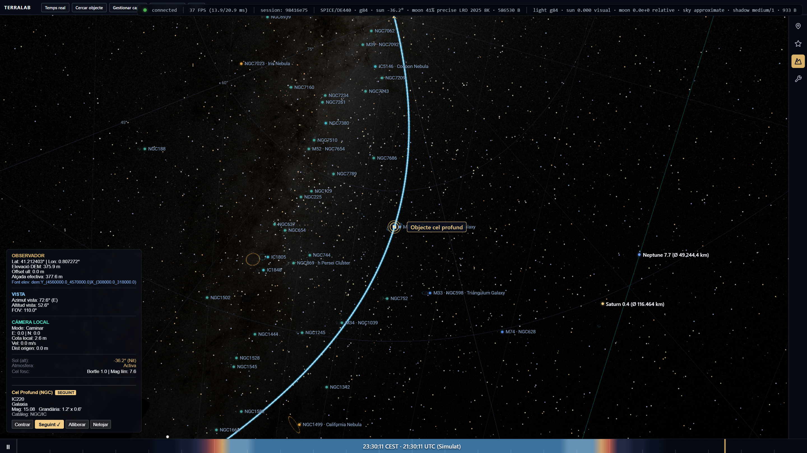

### 8.2. Com s'utilitza

1. Seleccioneu qualsevol cos celeste (Sol, Lluna, planeta, estrella o objecte NGC).
2. La casella **Trajectòria de l'objecte** a la pestanya **Cel** ve activada per defecte.
3. El sistema calcula la trajectòria per a un interval complet de **24 hores**.
4. **Conservació contínua de la línia:** Quan moveu la línia de temps o canvieu l'hora dins d'aquestes 24 hores, la línia de trajectòria es manté dibuixada sense parpellejos ni recàlculs innecessaris. El marcador lluminós de posició actual s'anima en temps real al llarg del traç.
5. Si desplaceu el temps més enllà de les 24 hores o canvieu d'astre o d'observador, el sistema recalcula automàticament el nou interval.

#### Llegenda de Visibilitat

- `━━━━` **Cian continu brillant:** Segment visible per sobre de les muntanyes.
- `┄ ┄ ┄` **Lila neó discontinu:** Segment ocult darrere del relleu 3D (visible clarament a través de les muntanyes).
- `┄ ┄ ┄` **Lila clar puntejat:** Segment situat per sota de l'horitzó pla a 0°.
- `┈ ┈ ┈` **Ambre puntejat:** Dades insuficients de perfil DEM.

| Alba sobre el relleu oriental | Posta darrere les serralades |
| :---: | :---: |
|  |  |
| *Etiqueta compacta d'alba amb traç subterrani.* | *Línia discontínua lila travessant el relleu 3D.* |

| Perspectiva panoràmica completa | Comparació Horitzó Real vs. Pla 0° |
| :---: | :---: |
| 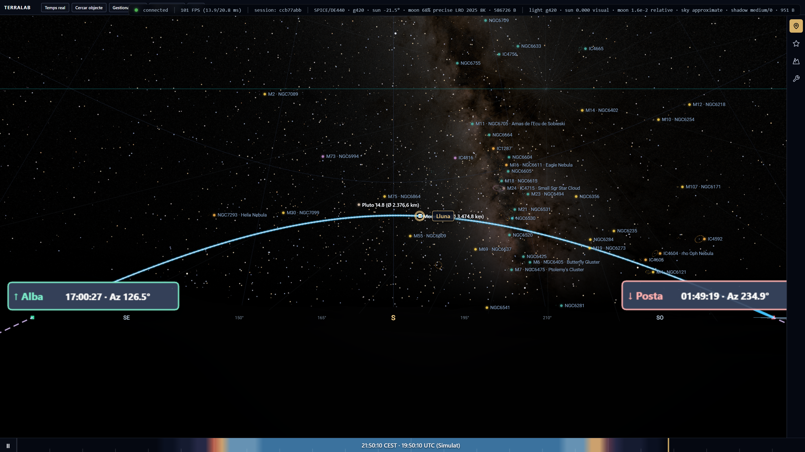 | 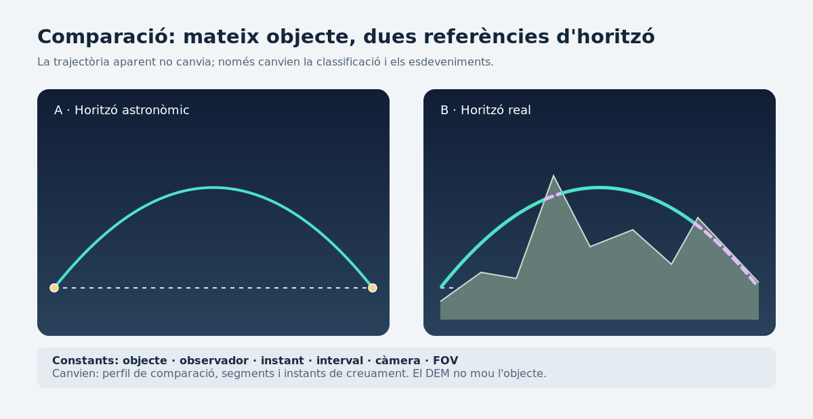 |
| *Vista general en zoom-out amb caiguda a l'horitzó.* | *Impacte del relleu avançant la posta i retardant l'alba.* |

### 8.3. Com funciona per dins: Refinament de Creuaments per Bisecció

El sistema mostreja la posició de l'astre en 128 intervals adaptatius i avalua la funció d'elevació aparent respecte a la silueta de l'horitzó $h_{\text{DEM}}(\text{az})$:
$$f(t) = \text{alt}_{\text{astre}}(t) - h_{\text{DEM}}(\text{az}(t))$$
Quan es detecta un canvi de signe $f(t_1) \cdot f(t_2) < 0$, el coordinador Python aplica un algorisme de **bisecció d'arrels** per determinar l'instant exacte del creuament $t^*$ amb precisió subsegon.

**Passos d'origen:** [Pas 9 — Trajectòries](tasques/completat/pas9.md), [Pas 15 — Perfil d'horitzó](tasques/completat/pas15.md), [Pas 22 — Trajectòries i visibilitat sobre l'horitzó real](tasques/completat/pas22-trajectories-visibilitat.md).

---

## 9. 🌌 El Cel: Traces Estel·lars i Exposició Temporal (Star Trails)

### 9.1. Què fa i per a què serveix

Simula captures fotogràfiques de molt llarga exposició, acumulant de forma progressiva les traces circulars que descriuen les estrelles al voltant del pol celeste a mesura que la Terra gira.

### 9.2. Com s'utilitza

1. A la pestanya **🌌 Cel**, obriu la secció **Traces estel·lars (Star Trails)**.
2. Premeu **Iniciar exposició** i avanceu el temps de simulació. La càmera s'orientarà automàticament cap al pol celeste (Polaris a l'hemisferi nord) i començarà a dibuixar els arcs lluminosos continus.
3. Premeu **Pausa** per aturar la captura o **Reiniciar** per netejar el buffer.

### 9.3. Com funciona per dins

El mòdul acumula a la GPU segments de línia obtinguts per la integració de la velocitat angular sideral de la Terra:
$$\omega_{\text{sideral}} = \frac{2\pi}{86164.0905\text{ s}} \approx 7.292115 \times 10^{-5}\text{ rad/s}$$
mantenint un nombre fitat de recursos de GPU mitjançant buffers circulars retinguts.

**Passos d'origen:** [Pas 14 — Traces circumpolars](tasques/completat/pas14.md).

---

## 10. ⛰️ Terra: Relleu DEM 3D, Horitzó Real Calculat i Cobertura de Superfície

### 10.1. Què fa i per a què serveix

Reconstrueix la topografia tridimensional del paisatge al voltant de l'observador a partir de models digitals d'elevació (DEM), calcula la silueta d'horitzó real a 360° tenint en compte la curvatura de la Terra i la refracció atmosfèrica, i aplica textures categòriques de Land Cover amb identificació en passar el ratolí.

### 10.2. Com s'utilitza

- A la pestanya **⛰️ Terra (Topografia)**:
  - Activeu **Horitzó real** per calcular l'oclusió sobre les muntanyes.
  - Activeu **Cobertura de superfície** per visualitzar boscos, conreus, masses d'aigua i zones urbanes.
  - Feu clic a qualsevol punt de la muntanya per activar el vol ràpid **GoTo** cap a aquella coordenada.
  - Passeu el ratolí sobre el relleu per veure el tipus de cobertura vegetal en una etiqueta emergent.

### 10.3. Com funciona per dins: Càlcul de l'Horitzó Angular Topogràfic

L'altitud de l'horitzó angular des de la posició de l'observador a alçada $h_0$ a una distància $d$ sobre la cota $h(d)$ s'avalua considerant la curvatura terrestre i la refracció atmosfèrica mitjançant el **Radi Terrestre Efectiu** $R_{\text{eff}} = \frac{4}{3} R_{\text{Terra}} \approx 8495\text{ km}$:
$$\theta_{\text{hor}}(\text{az}) = \max_{d \in [0, d_{\max}]} \left[ \arctan\left( \frac{h(d, \text{az}) - h_0 - \frac{d^2}{2 R_{\text{eff}}}}{d} \right) \right]$$

**Passos d'origen:** [Pas 15 — Elevació i horitzó](tasques/completat/pas15.md), [Pas 16 — Terreny 3D retingut](tasques/completat/pas16.md), [Pas 17 — Superfície categòrica](tasques/completat/pas17-superficie-progressiva.md).

---

## 11. 📐 Eines: Modes d'Observació Instrumental (Òptica i Fotografia)

### 11.1. Què fa i per a què serveix

Permet simular la visió a través d'instruments òptics reals: ull humà natural (*Naked Eye*), càmeres fotogràfiques amb diferents formats de sensor i distàncies focals, i telescopis astronòmics amb oculars intercanviables.

| Ull nu (*Naked Eye*) | Càmera fotogràfica (*Camera*) | Telescopi (*Scope*) |
| :---: | :---: | :---: |
| 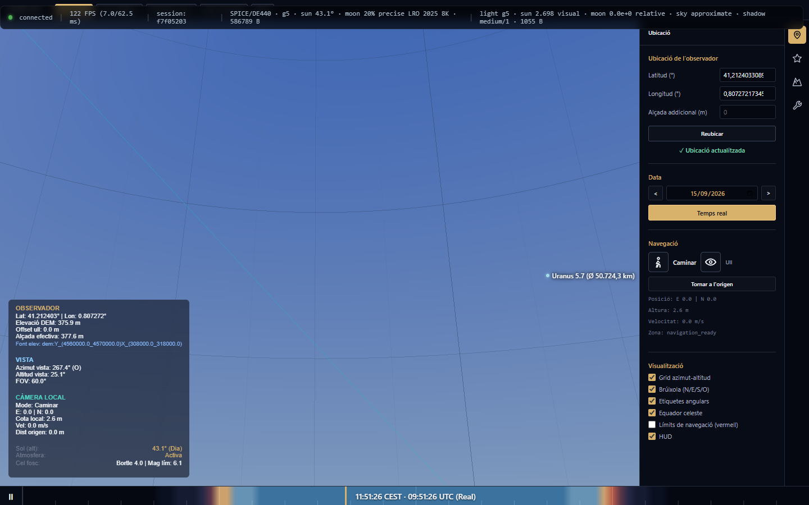 | 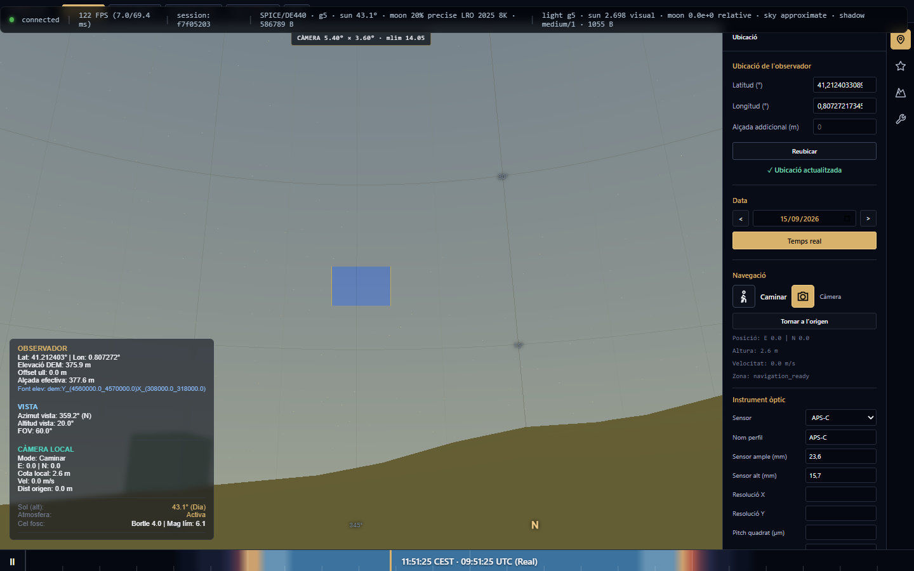 | 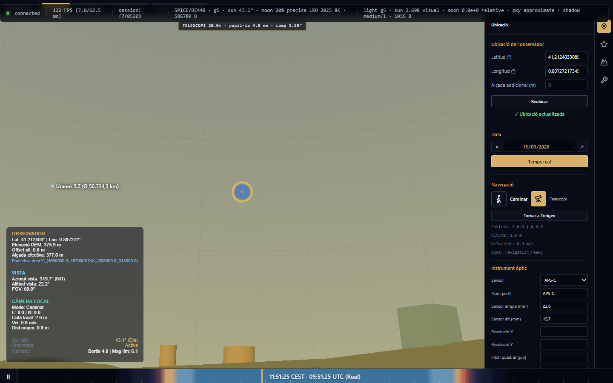 |
| *Visió humana natural a 360°.* | *Simulació de sensor (Full Frame, APS-C) i focal.* | *Reticle circular d'ocular i magnificació.* |

### 11.2. Com s'utilitza

1. A la pestanya **📐 Eines**, trieu el mode d'observació desitjat:
   - **Mode Càmera:** Seleccioneu la mida del sensor (*Full Frame 35mm*, *APS-C*, *Micro 4/3*, *1"*) i la distància focal de l'objectiu ($14\text{ mm} - 600\text{ mm}$). La cúpula mostrarà el marc de composició amb el camp de visió exacte.
   - **Mode Telescopi:** Definiu la distància focal del tub òptic i de l'ocular per calcular el cercle de camp i l'augment.

### 11.3. Com funciona per dins: Òptica Geomètrica

El camp de visió horitzontal ($\text{FOV}_{\text{h}}$) i vertical ($\text{FOV}_{\text{v}}$) d'un sensor de dimensions $w_{\text{sensor}} \times h_{\text{sensor}}$ i distància focal $f$ es calcula com:
$$\text{FOV}_{\text{h}} = 2 \arctan\left( \frac{w_{\text{sensor}}}{2 f} \right), \quad \text{FOV}_{\text{v}} = 2 \arctan\left( \frac{h_{\text{sensor}}}{2 f} \right)$$
La magnificació telescòpica s'obté com $M = \frac{f_{\text{telescopi}}}{f_{\text{ocular}}}$.

**Passos d'origen:** [Pas 19 — Modes d'observació instrumental](tasques/completat/pas19-modes-optics.md).

---

## 12. 📐 Eines: Instruments de Mesura Esfèrica

### 12.1. Què fa i per a què serveix

Permet traçar instruments de mesura directa sobre l'esfera celeste: regles de distància angular (cercle màxim), cercles esfèrics, quadrats i rectangles orientats, amb càlcul rigorós de distàncies en graus, minuts i segons ($^\circ \ ' \ ''$) i àrees en graus quadrats ($\text{deg}^2$) o estereoradiants ($\text{sr}$).

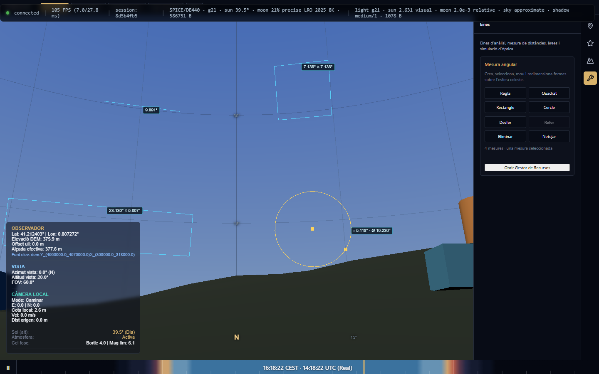

### 12.2. Com s'utilitza

1. Aneu a la pestanya **📐 Eines** i trieu una eina: **Regla**, **Cercle**, **Quadrat** o **Rectangle**.
2. Feu clic i arrossegueu sobre la cúpula 3D per traçar la figura.
3. Utilitzeu les nanses de vora per redimensionar o rotar la mesura.
4. Desfeu o torneu a aplicar canvis amb `Ctrl+Z` / `Ctrl+Y` o mitjançant els botons de la interfície:

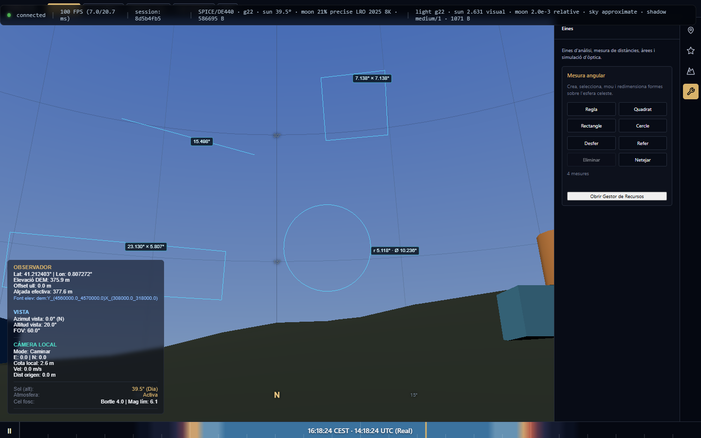

### 12.3. Com funciona per dins: Geometria Esfèrica i Fórmula del Semiversin

La separació angular $\Delta \sigma$ entre dos punts $(\alpha_1, \delta_1)$ i $(\alpha_2, \delta_2)$ es resol mitjançant la **fórmula del semiversin** (*haversine*), immune a errors d'arrodoniment en angles petits:
$$\text{hav}(\Delta \sigma) = \sin^2\left(\frac{\delta_2 - \delta_1}{2}\right) + \cos \delta_1 \cos \delta_2 \sin^2\left(\frac{\alpha_2 - \alpha_1}{2}\right)$$
$$\Delta \sigma = 2 \arcsin\left(\sqrt{\text{hav}(\Delta \sigma)}\right)$$
L'àrea d'un polígon esfèric de $n$ vèrtexs amb angles interiors $\theta_i$ es calcula a partir de l'**excés esfèric de Girard ($E$)**:
$$E = \left( \sum_{i=1}^n \theta_i \right) - (n - 2)\pi \quad [\text{sr}], \quad \text{Àrea} = E \cdot \left(\frac{180}{\pi}\right)^2 \quad [\text{deg}^2]$$

**Passos d'origen:** [Pas 21 — Eines de mesura esfèrica](tasques/completat/pas21-eines-mesura.md).

---

## 13. 🌌 Constel·lacions de referència i figures pròpies

### 13.1. Cerca i observació

El cercador reconeix el nom llatí i l'abreviatura de cadascuna de les 88 constel·lacions IAU. En seleccionar-ne una, TerraLab3D mostra la figura visual adoptada, centra el seu centre calculat sobre aquest traçat i permet aplicar-hi el seguiment i la trajectòria del cel com a qualsevol altre objectiu equatorial fix.

Les línies visibles són un **traçat visual de referència**, no fronteres ni línies oficials de la IAU. El centre i el radi d'enquadrament també descriuen aquest traçat. En el cas de Serpens, Caput i Cauda pertanyen a una única constel·lació però es mantenen com dos components desconnectats.

### 13.2. Edició de figures pròpies

1. Aneu a **📐 Eines → Constel·lacions** i creeu o seleccioneu un grup.
2. Activeu **Editar** i feu clic prop d'una estrella visible; la candidata ha d'estar a un màxim de 16 píxels.
3. Useu **Traç nou** per començar un component discontinu, i **Finalitzar** per sortir de l'edició.
4. Podeu reanomenar, eliminar, desfer i refer durant la sessió. El document es desa entre reinicis, però l'historial de desfer/refer no.
5. **Mostrar totes** només canvia la visibilitat del catàleg i no modifica les figures pròpies.

El traçat de referència deriva de d3-celestial sota BSD-3-Clause. L'avís complet, el commit i els fitxers d'origen consten a [THIRD-PARTY.md](../THIRD-PARTY.md).

**Pas d'origen:** [Pas 23 — Constel·lacions](tasques/pendent/pas23-constellacions.md).

---

## Apèndix A — Taula de Dreceres de Teclat i Gestos Ràpids

| Tecla / Gest | Acció | Context operatiu |
| :--- | :--- | :--- |
| `Esc` | Allibera seguiment de càmera / Tanca diàlegs / Retorna a Ull nu | Global |
| `W`, `A`, `S`, `D` | Desplaçament de càmera endavant, esquerra, enrere, dreta | Mode Caminar / Avió |
| `Espai` | Pausa / Reprèn el rellotge de simulació temporal | Global |
| `Ctrl + Z` | Desfer la darrera mesura o edició | Eines de mesura |
| `Ctrl + Y` / `Ctrl + Shift + Z` | Refer la darrera mesura desfeta | Eines de mesura |
| `Supr` / `Delete` | Elimina la mesura esfèrica seleccionada | Eines de mesura |
| `Roda del ratolí` | Zoom / Variació contínua del camp visual ($\text{FOV}$) | Global |
| `Clic esquerre` | Selecció d'astres, identificació Gaia o punts DEM | Global |

---

## Apèndix B — Oracles de Càlcul Científic, Fonts de Dades i Toleràncies

| Mòdul | Font de dades científica / Oracle | Tolerància de validació |
| :--- | :--- | :--- |
| **Temps i Sideral** | IAU SOFA / IERS Conventions (GMST, LST) | $\le 10^{-6}\text{ s}$ d'error temporal |
| **Efemèrides Planetàries** | JPL DE440 / SPICE kernels | $\le 0.05''$ d'arc topocèntric |
| **Catàleg Estel·lar** | ESA Gaia DR3 / Hipparcos fallback | $\le 0.01''$ d'arc en posicions J2000 |
| **Superfície Lunar** | NASA LRO/LOLA 8K albedo & topography | Precisió d'albedo 8-bit, libració $< 0.01^\circ$ |
| **Topografia i Elevació** | Models Digitals d'Elevació (DEM) locals | Interpolació bilineal sub-mètrica |
| **Òptica i Mesures** | Fórmules analítiques de cercle màxim i Girard | $\le 10^{-5}\text{ deg}$ d'error angular |

---

## Apèndix C — Preguntes Freqüents i Resolució d'Incidències (FAQ)

### Com puc seguir un planeta o la Lluna mentre avança el temps ràpidament?

Feu clic sobre el cos celeste o cerqueu-lo al cercador de la pestanya **Cel**. El sistema activarà immediatament el seguiment de càmera (`Seguint ✓` al HUD daurat), mantenint el cos centrat durant l'avanç temporal.

### Per què la línia de trajectòria es veu discontínua i lila?

La línia discontínua lila indica que en aquell tram l'astre està ocult darrere de les muntanyes del relleu local o sota l'horitzó. El traç es manté visible perquè pugueu anticipar exactament per on i a quina hora sortirà o es pondrà l'astre.

### Com puc saber l'hora exacta de posta de sol darrere una muntanya?

Seleccioneu el Sol i activeu la casella *Trajectòria de l'objecte*. A la cúpula 3D apareixerà una targeta compacta anomenada `↓ Posta` amb l'hora exacta del creuament del disc solar amb la carena de la muntanya.

### Com puc comprovar com es veurà una constel·lació amb la meva càmera i objectiu?

Aneu a la pestanya **Eines**, seleccioneu el mode **Càmera**, trieu el vostre sensor (ex: *Full Frame 35mm*) i la focal que voleu utilitzar (ex: *50 mm*). La pantalla mostrarà el marc de composició exacte que obtindreu a la vostra fotografia.

---

> **TerraLab3D** — Desenvolupat amb rigor científic i tecnologies web d'última generació.
