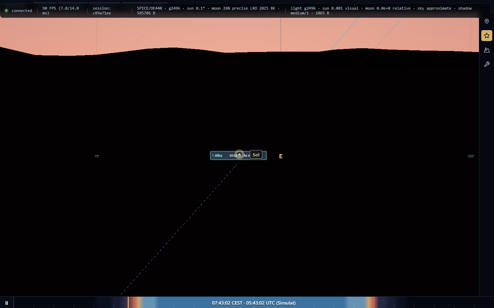
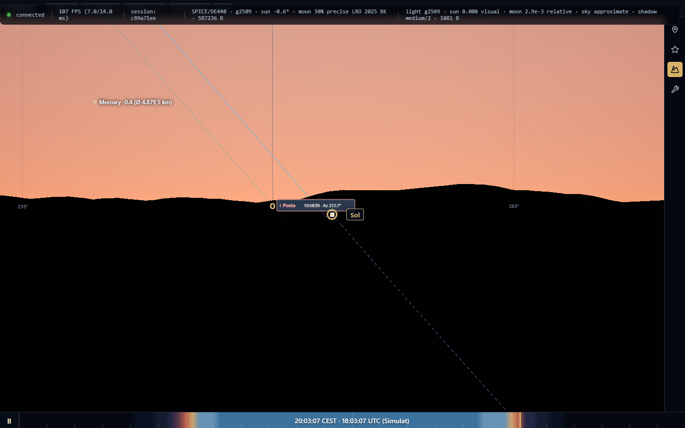
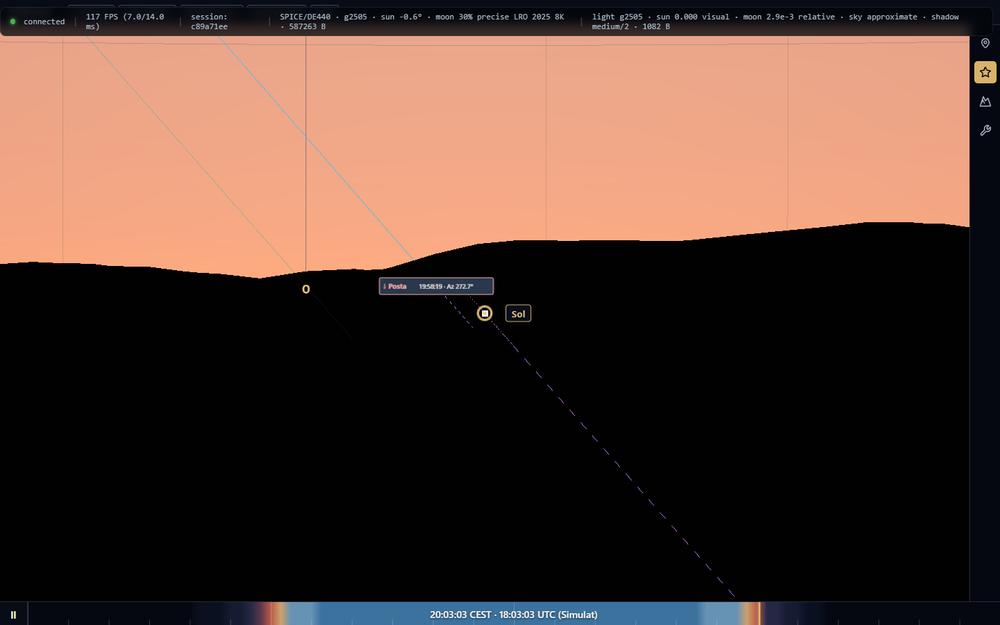

# TerraLab3D — Manual d'usuari avançat

> Edició viva. Només es descriuen com a operatives les capacitats verificades sobre l'arbre oficial del projecte.

## Benvinguda i mapa de pantalles

TerraLab3D és un laboratori astronòmic i geogràfic tridimensional que combina càlcul científic rigorós (SPICE, Skyfield, DE440, models DEM reals) amb renderitzat 3D interactiu mitjançant Three.js.

### Mapa d'interfície

1. **Cúpula celeste central (Canvas 3D):** visualització immersiva a 360° de la volta celeste, estrelles del catàleg Gaia DR2/DR3 (amb fallback natiu), Sol, Lluna amb mapa LRO/LOLA 8K, planetes, satèl·lits naturals, objectes de cel profund NGC/IC i terreny DEM 3D amb perfil d'horitzó local.
2. **Calaix de navegació lateral (pestanyes):**
   - **Ubicació:** posició geogràfica de l'observador (latitud, longitud, alçada, offset d'ull), orientació i visibilitat de l'equador celeste.
   - **Cel:** control de fons celest, atmosfera física, contaminació lumínica (Bortle o límit de magnitud), cossos del Sistema Solar, òrbites, Via Làctia, pols de Planck, cerca d'astres i **Trajectòria i horitzó**.
   - **Terra:** gestió del model digital d'elevació (DEM), perfil d'horitzó calculat, textures de cobertura i càmeres locals.
   - **Eines:** instruments de mesura esfèrica (regla, cercle, quadrat i rectangle) sobre la volta celeste.
3. **HUD informatiu (inferior esquerre):** dades topocèntriques de l'observador, orientació de càmera (azimut, altitud, FOV) i panell d'inspecció de l'astre o coordenada seleccionada amb botons d'acció ràpida (*Centrar*, *Seguir*, *Alliberar*, *Netejar*).
4. **Línia temporal (inferior):** rellotge de simulació, temps sideral local (LST), velocitat temporal ajustable i salts directes.

---

## Controls i navegació bàsica

- **Rotació de vista:** arrossegar amb el botó esquerre del ratolí sobre el cel per girar l'azimut i l'altitud de la visual.
- **Zoom / Camp de visió (FOV):** girar la roda del ratolí per ampliar o reduir el camp visual.
- **Centrat sobre un astre:** seleccionar un astre des del cercador o mitjançant clic directe, i prémer el botó **Centrar** del HUD.
- **Modes d'observació:** alternar entre mode Ull nu, Càmera fotogràfica (amb reticle de sensor) i Telescopi. La tecla `Escape` allibera seguiments i retorna a ull nu.

---

## Trajectòries i visibilitat sobre l'horitzó real

**Pas d'origen:** [Pas 22 — Trajectòries i visibilitat sobre l'horitzó real](completat/pas22-trajectories-visibilitat.md).

Permet visualitzar la trajectòria aparent i la visibilitat d'un astre calculada respecte a l'orografia del terreny 3D (perfil d'horitzó DEM) o contra l'horitzó geomètric pla a 0°.

### Com utilitzar-ho

1. Obre la pestanya **Cel** de la barra d'eines lateral.
2. Al cercador integrat, cerca qualsevol cos celeste (Sol, Lluna, planetes, satèl·lits, estrelles o cel profund) o clica'l directament a l'esfera celeste.
3. La casella **Trajectòria de l'objecte** està activada per defecte: en seleccionar l'astre, el sistema en projecta immediatament la trajectòria detallada sobre la volta celeste.
4. L'interval és sempre automàtic de **24 hores** (±12 h respecte a l'instant de simulació) i es recalcula automàticament sense intervenció de l'usuari en desplaçar el temps o saltar de data.
5. El perfil d'horitzó utilitzat s'enllaça directament amb l'estat del relleu: si a la pestanya **Topografia** està marcat *Horitzó real*, el càlcul utilitza el perfil DEM circumdant de l'observador; en cas contrari, utilitza l'horitzó astronòmic pla a 0°.
6. Els esdeveniments de sortida (↑) i posta (↓) s'indiquen tant a la línia d'estat del panell com mitjançant targetes ancorades a la volta celeste amb l'hora i l'azimut precisos.

### Llegenda visual de trajectòries

| Estil de traç | Significat | Descripció |
| :--- | :--- | :--- |
| Codi visual | Significat | Comportament |
| :--- | :--- | :--- |
| `━━━━` **Cian elèctric continu** | **Visible sobre el relleu** | L'astre és visible per sobre de les carenes i muntanyes del relleu local. Traç únic i nítid d'alta visibilitat. |
| `┄ ┄ ┄` **Lila neó discontinu** | **Ocult pel relleu** | L'astre es troba darrere el perfil de les muntanyes o sota l'horitzó. Es dibuixa amb traç geomètric discontinu lila neó (`#d946ef` / `#c084fc`) visible clarament a través de la malla 3D del terreny. |
| `◎` **Cercles concèntrics** | **Marcador temporal actiu** | Posició exacta de l'objecte a l'instant de simulació actual sobre la trajectòria. |
| `↓` / `↑` **Targetes d'esdeveniment** | **Posta i sortida** | Etiquetes d'alta visibilitat que indiquen l'hora exacta i l'azimut del creuament amb el relleu, invariants al zoom (26 px constants). |

### Seguiment automàtic per defecte
En clicar qualsevol cos celeste a la vista 3D o cercar-lo, el sistema activa immediatament i per defecte el seguiment de càmera (`Seguir`), sense requerir cap acció manual addicional al HUD.

### Evidències d'esdeveniments celestes sobre el relleu

#### 1. Alba sobre el relleu oriental
El Sol emergint sobre la carena de les muntanyes orientals amb l'etiqueta de sortida i la traça discontínua lila subterrània:

#### 2. Posta de Sol darrere les muntanyes (amb línia discontínua lila pel relleu)
El Sol ponent-se darrere la serralada occidental, amb la línia discontínua lila travessant nítidament tot el cos de les muntanyes:

#### 3. Trajectòria completa general de l'objecte (perspectiva panoràmica zoom-out)
Vista panoràmica d'ampli angle (FOV 100°) mostrant la identificació del cos seleccionat al HUD, el Sol visible en descens i tot l'arc de la trajectòria caient des del zenit cap a la serralada:

### Comparació d'horitzons

Quan el terreny DEM està actiu, una muntanya o serralada avança l'hora de posta i retarda la sortida respecte al pla geomètric:

Si es desactiva l'horitzó real a la pestanya Topografia, el càlcul commuta de forma instantània a l'horitzó astronòmic pla a 0°:

### Etiquetes d'esdeveniment adaptatives al zoom

Les caixes de text d'alba i posta s'adapten dinàmicament a la distància focal i al zoom de la càmera (FOV), mantenint una mida constant i perfectament llegible (26 px de pantalla) sense deformar-se ni miniaturitzar-se:

### Arquitectura interna

- **Resolució detallada fixa:** el coordinador genera sempre 128 mostres temporals adaptatives al llarg de les 24 hores, garantint màxima fidelitat geomètrica.
- **Refinament per bisecció:** els instants exactes de sortida i posta es troben resolent $f(t) = \text{alt}_{\text{astre}}(t) - \text{alt}_{\text{horitzó}}(\text{az}(t)) = 0$ fins a una precisió subsegon.
- **Buffer binari V2 d'alt rendiment:** les dades es transmeten mitjançant un únic buffer compacte `ArrayBuffer` que inclou direccions ENU, deltes de temps, màscares de validesa i estats de visibilitat.
- **Renderitzat de traç únic:** eliminació d'artefactes de múltiples línies paral·leles; traç únic net amb materials optimitzats i `depthTest: false` amb `renderOrder` superior per garantir la transparència a través del relleu muntanyós.
- **Reavaluació automàtica:** el sistema monitoritza el temps de simulació i desplaça o recalcula l'interval en segon pla quan el cursor s'apropa als límits de cobertura o es produeix un salt temporal.

---

## Eines de mesura esfèrica

**Pas d'origen:** [Pas 21 — Regla, quadrat, rectangle i cercle editables](completat/pas21-eines-mesura.md).

A la pestanya **Eines**, l'usuari pot traçar regles d'arc de cercle màxim, quadrats, rectangles orientats i cercles sobre l'esfera celeste:
- Càlcul de distàncies angulars reals en graus, minuts i segons.
- Edició interactiva mitjançant nanses de vora i extrems.
- Suport per a desfer/refer (`Undo`/`Redo`) i neteja total.

---

## Limitacions conegudes

- Les constel·lacions estan pendents d'incorporació al flux de trajectòries al [Pas 23](pendent/pas23-constellacions.md).
- La visibilitat és geomètrica respecte a l'horitzó: no té en compte la nuvolositat meteorològica ni la magnitud d'extinció instrumental.
