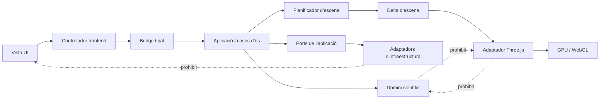
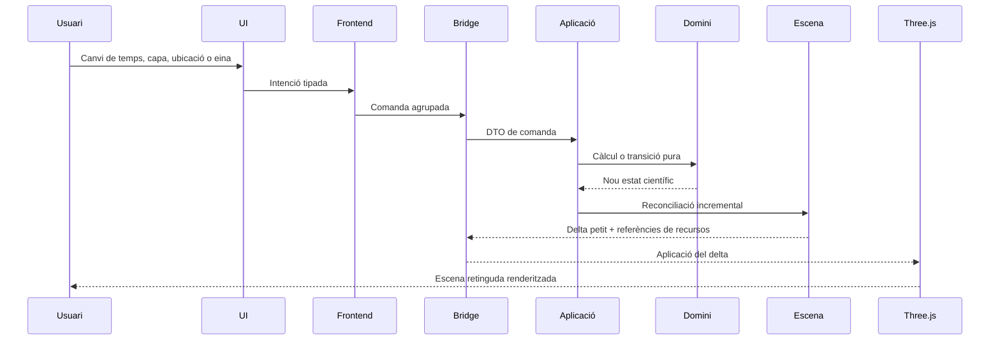
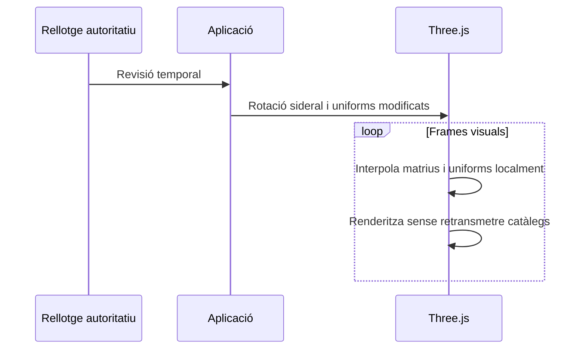
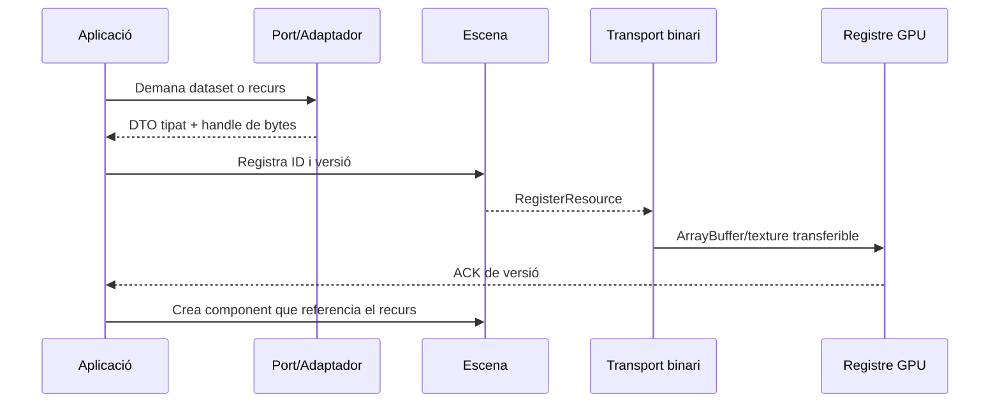
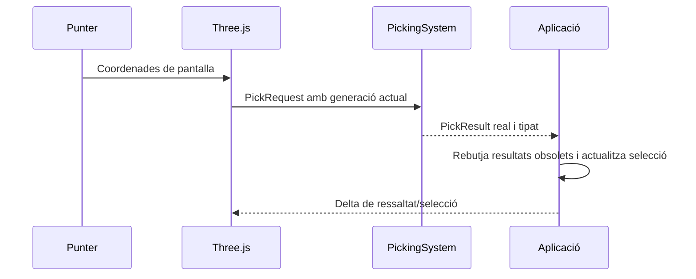

# Arquitectura de TerraLab3D

## Arbre de paquets

```text
TerraLab3D/
├── backend/src/terralab3d/
│   ├── domain/
│   │   ├── science/              # unitats, èpoques i precisió compartides
│   │   ├── <capacitat>/models.py
│   │   ├── <capacitat>/calculations.py
│   │   └── <capacitat>/services.py
│   ├── application/
│   │   ├── commands.py
│   │   ├── events.py
│   │   ├── use_cases/
│   │   └── ports/
│   ├── scene/                    # escena neutral i deltes
│   └── infrastructure/adapters/
├── frontend/src/
│   ├── application/
│   ├── bridge/
│   ├── contracts/
│   └── view/
│       ├── ui/
│       └── three/
├── contracts/schemas/
└── docs/
```

## Direcció de dependències



## Flux de comandes



## Flux d’actualització temporal



## Flux de recursos



## Flux de picking



## Propietat dels càlculs

- **Domini:** astronomia, fotometria, geodèsia, òptica, horitzó, terreny i geometria esfèrica.
- **Aplicació:** ordre dels casos d’ús, cancel·lació, estat de sessió i sincronització.
- **Escena:** recursos i components neutrals, sense fórmules científiques.
- **Three.js:** projecció de pantalla, GPU, shaders visuals, càmera, interpolació i picking.
- **Infraestructura:** I/O, xarxa, catàlegs, DEM, persistència, caché i workers.

## Restriccions de rendiment

- Gaia, textures i malles són recursos persistents i versionats.
- La volta celeste gira amb transformacions/uniforms, no recalculant cada estrella.
- El moviment de càmera no travessa el bridge científic.
- El backend només publica deltes científicament necessaris.
- El snapshot complet és excepcional; el camí normal és incremental.
