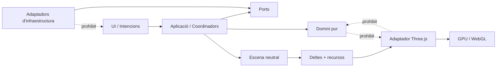
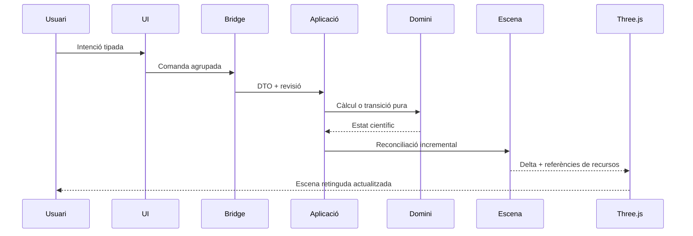
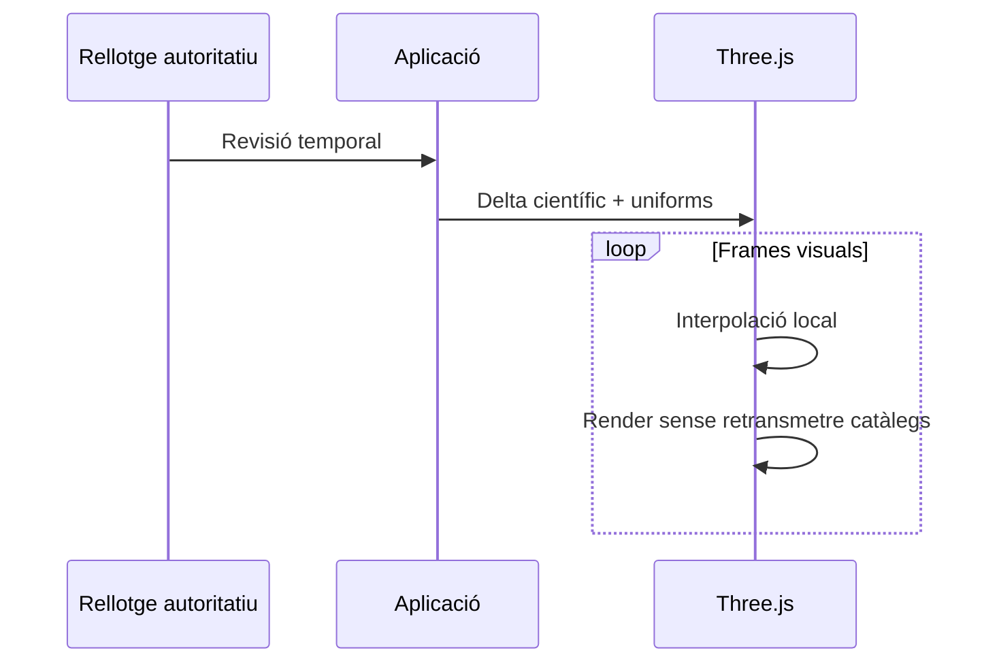
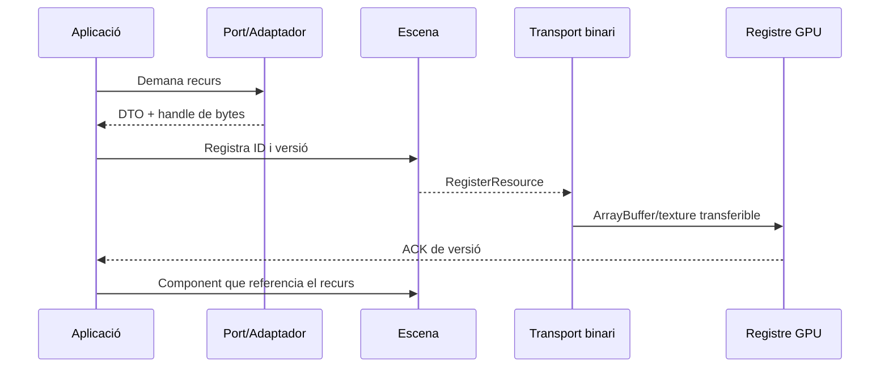
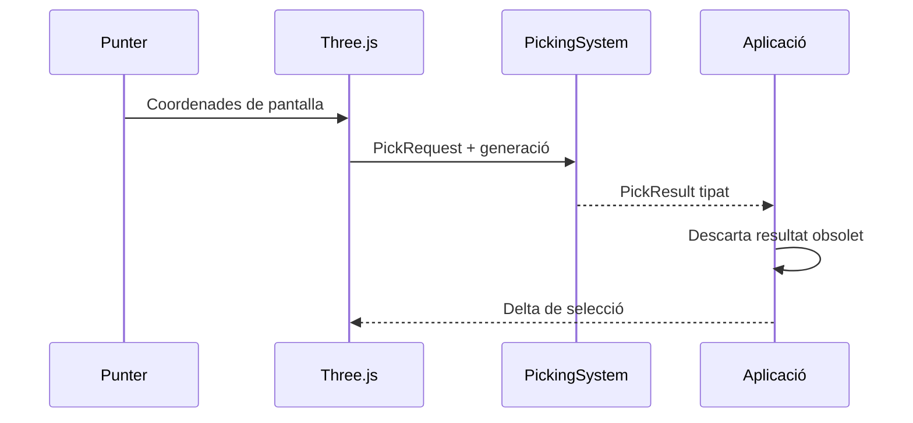

# Normes d'arquitectura i execució

Aquest document concentra les decisions transversals. L'ordre i l'estat verificable viuen al [pla de millores](README.md); el detall executable viu al document de cada pas.

Els noms, comentaris i documentació de negoci s'escriuen en català. Es mantenen en anglès els termes de convenció tècnica o científica quan traduir-los faria el codi menys natural.

## Finalitat

TerraLab3D és una aplicació científica tridimensional independent, amb separació estricta entre domini, aplicació, infraestructura, escena neutral i adaptador Three.js. Cada pas ha de deixar un avenç executable i observable; no hi ha passos dedicats només a crear carpetes, interfícies o proves.

“Homologable amb TerraLab” significa equivalència acceptada de comportament visible i càlcul científic, amb toleràncies i evidències. No significa copiar l'arquitectura QPainter ni obtenir píxels idèntics.

## Font funcional i norma de consulta

L'oracle és [TerraLab al commit auditat `1fbcf088a0bfc1f832fc0f2a8ba2808e3e783a7d`](https://github.com/ArcadiaLliure/TerraLab/tree/1fbcf088a0bfc1f832fc0f2a8ba2808e3e783a7d). Les especificacions enllacen els fitxers concrets mitjançant permalinks d'aquest commit; per exemple, la referència visual principal és [widget_controls_builder.py](https://github.com/ArcadiaLliure/TerraLab/blob/1fbcf088a0bfc1f832fc0f2a8ba2808e3e783a7d/TerraLab/ui/widget_controls_builder.py).

L'oracle s'utilitza només en lectura per consultar:

- comportament, controls i valors per defecte;
- fórmules, transformacions i casos límit;
- catàlegs, manifests, llicències i formats persistents;
- eines interactives, fallbacks, cancel·lació i memòria;
- proves i fixtures que permetin caracteritzar la paritat.

Un checkout local només és una comoditat de lectura i s'ha de verificar contra el commit fixat. No es modifica, reformata, mou ni neteja. TerraLab3D no pot dependre del seu checkout o runtime.

## Regles d'execució

1. Cada pas lliura una vertical funcional connectada a l'entrypoint oficial.
2. Compilar o superar tests aïllats no és criteri suficient de finalització.
3. Cada capacitat nova recorre la ruta real Python → bridge → Three.js quan correspon.
4. Càmera, projecció a pantalla, interpolació visual i render continu pertanyen al frontend.
5. Ciència autoritativa, selecció de dades i decisions de producte pertanyen al domini o l'aplicació Python.
6. Els recursos grans són persistents, binaris, versionats i tenen propietari explícit.
7. No s'envien catàlegs, malles o textures completes per frame o tick temporal.
8. Gaia, DEM, malles, rasters categòrics, Via Làctia i Planck no travessen el bridge en Base64.
9. Una migració comença caracteritzant el comportament de l'oracle fixat.
10. Una diferència intencional necessita justificació, evidència i acceptació.
11. No s'inventen dades ni implementacions falses per fer passar la UI.
12. Fallback, degradació i autoritat de les dades són visibles per a l'usuari.
13. Cada operació asíncrona té correlació, cancel·lació cooperativa i descart de revisions obsoletes.
14. Cada recurs GPU té propietari, pressupost i `dispose` verificable.
15. Cap càlcul científic viu en un shader, component UI o renderer Three.js.
16. Cap adaptador decideix visibilitat científica o comportament de producte.
17. Cada pas manté l'aplicació arrencable, usable i recuperable.
18. Un pas no anticipa capacitats posteriors tret que siguin imprescindibles per tancar la seva vertical.
19. Errors d'usuari no revelen stacktraces ni estructura interna; el log conserva context tècnic i correlació.
20. Les dependències noves es documenten sense duplicats a [`backend/pyproject.toml`](../backend/pyproject.toml) o [`package.json`](../package.json), amb la justificació adequada.

## Treball transversal obligatori

Aquestes activitats formen part de cada pas:

- [ ] Verificar el comportament actual de TerraLab3D i l'equivalent de TerraLab.
- [ ] Classificar cada element com `REUSE`, `EXTRACT`, `ADAPT`, `REWRITE`, `DISCARD` o `NEW`.
- [ ] Definir només els contractes estrictament necessaris per a la vertical.
- [ ] Implementar la ruta executable completa i mantenir responsabilitats clares.
- [ ] Afegir proves unitàries, d'integració i una comprovació manual reproduïble.
- [ ] Mesurar rendiment, memòria, bridge i GPU quan el pas afecta render o dades.
- [ ] Documentar errors, fallback, cancel·lació, lifecycle i procedència.
- [ ] Actualitzar caselles, evidències, [inventari funcional](inventari-funcional.md) i punter del [pla](README.md).
- [ ] Confirmar que no hi ha rutes demo, mocks o dependències de capa incorrectes.

## Cobertura funcional agrupada

| # | Funcionalitat | Passos principals |
|---:|---|---|
| 1 | Ubicació de l'observador | 2 |
| 2 | Data i temps astronòmic | 3 |
| 3 | Navegació i HUD | 1, 3.5, 4 |
| 4 | Fons del cel | 7 |
| 5 | Estrelles i Gaia | 5, 6 |
| 6 | Traces temporals | 14, 19 |
| 7 | Sistema Solar | 8, 8.5, 8.6, 8.7, 9, 22, 26, 32, 35, 36 |
| 8 | Via Làctia i Planck | 10, 27 |
| 9 | Cel profund | 11, 27 |
| 10 | Cerca astronòmica | 12, 33 |
| 11 | Contaminació lumínica | 7 |
| 12 | Atmosfera | 7 |
| 13 | Horitzó | 15, 22 |
| 14 | Topografia i elevació | 16, 28 |
| 15 | Superfície i nomenclàtor | 17, 29, 37 |
| 16 | Modes d'observació instrumental | 19 |
| 17 | Camp instrumental | 19 |
| 18 | Simulació i interpretació fotogràfica | 19, 30 |
| 19 | Selecció i inspecció | 13 |
| 20 | Eines de mesura | 21 |
| 21 | Constel·lacions | 23 |
| 22 | Capes i AOI | 25 |
| 23 | Dades i recursos | 24, 26–29, 37 |
| 24 | Preferències, feedback, recuperació i homologació | 24, 25, 38 |

> El número 20 queda reservat com a traça històrica. La previsualització fotogràfica necessària per a l'observació instrumental forma part del Pas 19; el Pas 30 conserva la interpretació astromètrica de fotografies reals.

## Criteri global d'homologació

TerraLab3D es considera homologable quan:

- [ ] les 24 agrupacions tenen implementació observable i evidència;
- [ ] els càlculs astronòmics, fotomètrics, geoespacials i òptics compleixen toleràncies documentades;
- [ ] els fluxos de producte acordats són executables sense rutes de demostració;
- [ ] datasets, llicències, fallbacks i errors cobreixen els casos reals;
- [ ] càmera i render continu no depenen de round-trips Python;
- [ ] recursos grans romanen persistents i els ticks normals publiquen només deltes;
- [ ] picking i eines editables són reals, tipats, versionats i persistents;
- [ ] context loss, resync, restart i shutdown estan verificats;
- [ ] pressupostos P50/P95, memòria, draw calls i bridge es compleixen o tenen desviació acceptada;
- [ ] no queda dependència executiva de TerraLab ni diferència intencional sense documentar.

## Instrucció per a l'agent

Abans d'executar un pas:

1. Llegeix aquest document i el [README del pla](README.md).
2. Treballa exclusivament en el pas assenyalat pel punter.
3. Inspecciona el codi real i els permalinks de l'oracle inclosos a l'especificació.
4. Publica el mapa origen → transformació → destí quan migri comportament.
5. Implementa la vertical fins a l'entrypoint i executa les proves/evidències del document.
6. No marquis caselles sense evidència ni comencis el pas següent.
7. Aplica la skill `terralab-manel-style`; qualsevol altra skill només s'utilitza si està disponible i és pertinent.
8. En cada iteració actualitza el document del pas; en completar-lo aplica el protocol de tancament del README.

## Arquitectura base

### Arbre de responsabilitats

```text
backend/src/terralab3d/
  domain/          models, càlculs i serveis purs per capacitat
  application/     casos d'ús, coordinadors, ports i lifecycle
  infrastructure/  adapters d'I/O, xarxa, catàlegs, persistència i workers
  scene/           components i deltes neutrals de renderer

frontend/src/
  contracts/       DTOs i missatges compartits
  application/     controladors d'interacció i estat de presentació
  bridge/          transport i resync
  view/ui/         panells, controls i feedback
  view/three/      escena persistent, càmera, picking i recursos GPU
```

Els directoris reals són [`backend/src/terralab3d/`](../backend/src/terralab3d/) i [`frontend/src/`](../frontend/src/).

### Direcció de dependències



### Flux de comandes



### Flux temporal



### Flux de recursos



### Flux de picking



### Propietat dels càlculs

- **Domini:** astronomia, fotometria, geodèsia, òptica, horitzó, terreny i geometria esfèrica.
- **Aplicació:** casos d'ús, revisions, cancel·lació, sessió i sincronització.
- **Escena:** recursos i components neutrals, sense fórmules científiques.
- **Three.js:** projecció, GPU, shaders visuals, càmera, interpolació i picking.
- **Infraestructura:** I/O, xarxa, catàlegs, DEM, persistència, cache i workers.

### Restriccions de rendiment

- Gaia, textures i malles són recursos persistents i versionats.
- La volta celeste gira amb transformacions/uniforms, no recalculant cada estrella.
- El moviment de càmera no travessa el bridge científic.
- El backend publica deltes científicament necessaris; snapshots complets només per arrencada o recuperació.

## Inventari i mapa de transformació

L'[inventari funcional verificat](inventari-funcional.md) diferencia comportament observable, vertical parcial i esquelet. La ubicació d'un paquet no certifica el seu estat.

Cada especificació pendent conté els enllaços relatius al codi TerraLab3D que s'ha d'ampliar i els permalinks al commit auditat de TerraLab que cal consultar. `REUSE` exigeix tipar i verificar; `EXTRACT` aïlla lògica pura; `ADAPT` conserva comportament darrere un port; `REWRITE` conserva requisits i proves; `DISCARD` elimina presentació obsoleta; `NEW` crea una capacitat absent.

Disciplina de transformació:

1. Capturar comportament numèric i funcional.
2. Separar ciència, coordinació, I/O i presentació.
3. Traslladar només la responsabilitat del destí.
4. Substituir diccionaris ambigus per DTOs tipats.
5. Eliminar Qt i proveïdors concrets del domini/aplicació.
6. Exposar dades grans com a recursos binaris versionats.
7. Implementar Three.js com a escena persistent, no com a traductor de QPainter.
8. Comparar la vertical amb l'oracle abans d'homologar-la.

## Resum de decisions

1. **Projecte independent:** sense runtime ni renderer de TerraLab.
2. **Domini per capacitats:** models, càlculs i serveis amb responsabilitats clares.
3. **Aplicació per casos d'ús:** coordinadors legibles, sense controlador monolític.
4. **Escena retinguda:** Three.js conserva entitats/recursos; Python publica deltes.
5. **Recursos binaris versionats:** dades grans fora de JSON/Base64.
6. **Càmera local:** navegar/interpolar no força càlcul científic ni retransmissió.
7. **Picking real:** la vista retorna impactes tipats; l'aplicació decideix la selecció.
8. **Oracle, no arquitectura:** es migren comportament, fórmules, fixtures i dades.
9. **Paritat demostrable:** proves, mètriques i validació visual.
10. **Català documental i de negoci.**

## ADR 0001 — Frontera Python/TypeScript

### Decisió

Python és propietari de la ciència i l'estat de producte. TypeScript és propietari de la UI, càmera, escena Three.js persistent i recursos GPU.

### Conseqüències

- Dades grans travessen la frontera com a recursos binaris versionats.
- Les actualitzacions normals són deltes petits.
- TypeScript no calcula efemèrides ni consulta datasets científics.

## ADR 0002 — Escena retinguda i deltes

### Decisió

El frontend conserva entitats i recursos. El backend publica diferències entre generacions; els snapshots complets són només d'arrencada o recuperació.

### Conseqüències

Canviar la càmera no reconstrueix l'escena i canviar un segon no retransmet catàlegs, textures o terreny.

## ADR 0003 — La projecció de pantalla pertany a la vista

### Decisió

El domini transforma coordenades astronòmiques i produeix direccions o geometria de món. La càmera i la projecció a píxels pertanyen a Three.js.

### Conseqüències

No es migren projeccions QPainter al model. Les eines persisteixen coordenades celestes i el frontend resol la projecció interactiva.

## ADR 0004 — Transicions llargues interactives

### Decisió

Una transició llarga —viatge de càmera, càrrega, descàrrega, càlcul, canvi de context o refinament— manté l'escena útil i interactiva sempre que sigui possible. El progrés forma part de la mateixa experiència i no es cobreix amb una pantalla decorativa que amagui l'estat real.

### Conseqüències

- La càmera, escena retinguda i controls no es desmunten per mostrar una animació de càrrega.
- L'operació declara revisió, progrés determinat o indeterminat, cancel·lació i fallback.
- La transició representa el canvi real, respecta `prefers-reduced-motion` i no retarda artificialment la finalització.
- El [pas 38](tasques/pendent/pas38-homologacio-final.md) audita interactivitat, cancel·lació i pressupostos.

## ADR 0005 — Dades base empaquetades fora del gestor

### Decisió

Els datasets petits, obligatoris, versionats amb el producte i sense variants elegibles no són descàrregues gestionades. S'empaqueten amb manifest, checksum, procedència i llicència i s'obren mitjançant un port read-only.

### Conseqüències

- No apareixen al catàleg, cua ni AOI del [gestor de descàrregues](tasques/pendent/pas24-cataleg-recursos-descarregues.md).
- La seva absència o incompatibilitat és un error d'instal·lació/versionat, no una descàrrega implícita.
- Empaquetat no significa acoblament al renderer: domini, carregador/índex i batches continuen separats.
- GeoNames filtrat aplica aquest patró al [pas 37](tasques/pendent/pas37-geonames-empaquetat.md).
- Un dataset futur només l'adopta si compleix tots els criteris; si té variants, mida material o decisió d'usuari, passa pel gestor central.
