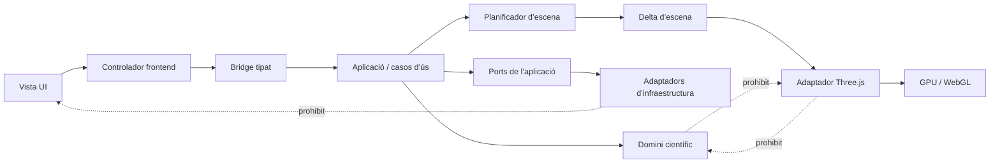
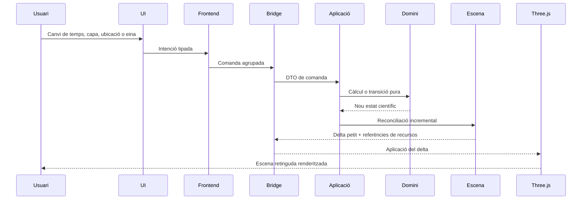
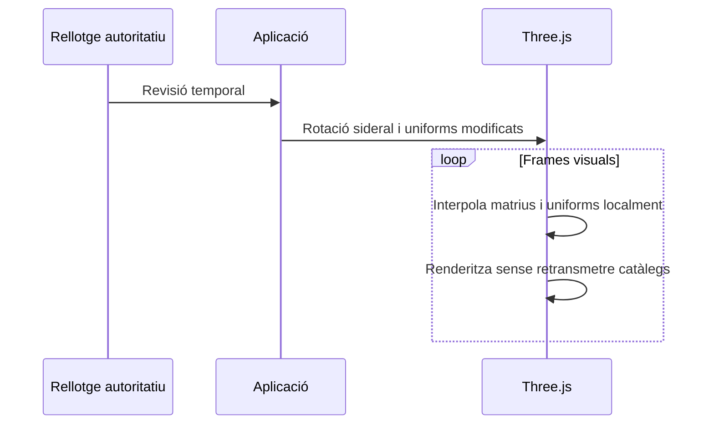
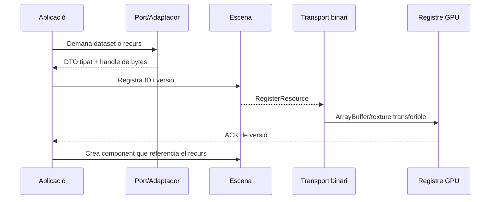
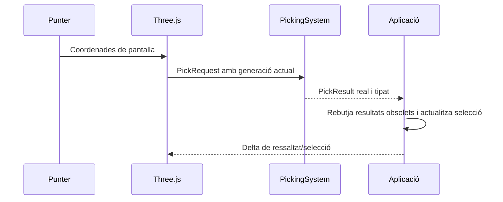

# Normes d’arquitectura i execució

Aquest document concentra les normes transversals del projecte, els criteris globals i les decisions que no pertanyen a un únic pas funcional.

Els noms d'arxius, mètodes, variables i comentaris sempre en català. Els comentaris han d'anar sempre en català. Hi ha variables i classes de "convencions" que sí que han d'estar en anglès, sinó seria estrany. El negoci propi sí que ha d'estar en català, esclareixo.

Reprodueix la mateixa UI i look and feel que E:\Desarrollo\TerraLab. Crec que l'arxiu de la UI és widget_controls_builder.py.

## Finalitat

Aquest pla converteix l’esquelet de TerraLab3D en una aplicació científica tridimensional completa, mantenint una separació estricta entre domini científic, aplicació, infraestructura, escena neutral i adaptador Three.js.

L’ordre està dissenyat perquè **cada pas deixi un avenç palpable, executable i observable**. No hi ha passos dedicats exclusivament a crear carpetes, interfaces, proves o infraestructura sense una funcionalitat connectada al producte.

“Homologable amb TerraLab” significa que cada comportament visible i cada càlcul científic rellevant de TerraLab disposa d’una equivalència implementada, mesurada i acceptada a TerraLab3D. No significa reproduir el pipeline QPainter ni obtenir píxels idèntics.

## Font funcional i norma de consulta

El repositori de referència és:

```text
E:\Desarrollo\TerraLab
```

Aquest repositori s’utilitza **només en mode lectura** per consultar:

- el comportament visible actual;
- els controls i valors per defecte;
- les fórmules i transformacions científiques;
- els catàlegs, manifests i datasets;
- els casos límit i modes de reserva;
- les eines interactives;
- les proves existents;
- les polítiques de cancel·lació, caché i memòria;
- els formats persistents que s’hagin de migrar.

La branca `fromcpu_togpu` de `github.com/ArcadiaLliure/TerraLab` s’ha utilitzat per confeccionar aquest pla. Abans de cada pas, l’agent ha de tornar a inspeccionar el checkout local real de `E:\Desarrollo\TerraLab`; el codi actual preval sobre aquest document quan hi hagi divergències.

No es pot modificar, reformatar, moure ni netejar cap fitxer de `E:\Desarrollo\TerraLab`.

## Regles d’execució

1. Cada pas lliura una vertical funcional executable des de l’entrypoint oficial.
2. Cap pas es considera acabat només perquè compili o perquè els seus tests aïllats passin.
3. Cada capacitat nova ha d’estar connectada a la ruta real Python → bridge → Three.js.
4. La càmera, la projecció a pantalla, la interpolació i el render continu viuen al frontend.
5. La ciència autoritativa, la selecció de dades i les decisions de negoci viuen al domini o a l’aplicació Python.
6. Els recursos grans són persistents, binaris, versionats i amb propietari explícit.
7. No s’envien catàlegs, malles o textures completes per cada frame o canvi de segon.
8. No s’utilitza Base64 per a Gaia, DEM, malles, ortofotos, Via Làctia o Planck.
9. Cada migració parteix d’una caracterització del comportament actual de TerraLab.
10. Les diferències intencionals requereixen justificació, evidència i acceptació.
11. No es creen implementacions falses que retornin dades inventades per fer passar la UI.
12. Els modes de reserva han de ser explícits i visibles per a l’usuari.
13. Cada operació asíncrona utilitza correlació, cancel·lació i descart de resultats obsolets.
14. Cada recurs GPU té un cicle de vida i un `dispose` verificable.
15. Cap càlcul científic pot quedar dins d’un shader, component UI o renderer Three.js.
16. Cap adaptador de dades pot decidir visibilitat científica o comportament de producte.
17. Cada pas manté TerraLab3D arrancable, usable i preparat per al pas següent.
18. No s’anticipa una capacitat posterior excepte quan sigui estrictament necessària per completar la vertical actual.

## Treball transversal obligatori dins de cada pas

Aquestes activitats no són passos separats. S’executen dins de cada vertical funcional:

- [ ] Identificar el comportament equivalent a TerraLab.
- [ ] Localitzar els símbols i fitxers font a `E:\Desarrollo\TerraLab`.
- [ ] Classificar cada element com `REUSE`, `EXTRACT`, `ADAPT`, `REWRITE`, `DISCARD` o `NEW`.
- [ ] Definir els contractes tipats estrictament necessaris per a la vertical.
- [ ] Implementar la ruta executable completa.
- [ ] Afegir proves unitàries del domini.
- [ ] Afegir proves d’integració del bridge i del frontend quan pertoqui.
- [ ] Afegir una comprovació manual reproduïble.
- [ ] Mesurar rendiment, memòria i bytes del bridge quan la vertical afecti render o dades.
- [ ] Documentar errors, fallback i lifecycle.
- [ ] Actualitzar la matriu de paritat.
- [ ] Actualitzar el mapa TerraLab → TerraLab3D.
- [ ] Confirmar que no s’han introduït dependències de capa incorrectes.
- [ ] Confirmar que la funcionalitat no depèn d’una ruta de demo o d’un mock.

## Matriu de cobertura de les 24 funcionalitats agrupades

| # | Funcionalitat agrupada | Passos principals |
| ---: | --- | --- |
| 1 | Ubicació de l’observador | 2 |
| 2 | Data i temps astronòmic | 3 |
| 3 | Navegació per l’escena | 1, 4 |
| 4 | Fons del cel | 6 |
| 5 | Estrelles i Gaia | 5 |
| 6 | Traces circumpolars | 14 |
| 7 | Sistema solar | 8, 8.5, 8.6, 8.7, 9 |
| 8 | Via Làctia i pols Planck | 10 |
| 9 | Cel profund NGC/IC | 11 |
| 10 | Cerca astronòmica | 12 |
| 11 | Contaminació lumínica | 7 |
| 12 | Meteorologia i atmosfera | 6, 18 |
| 13 | Horitzó | 15 |
| 14 | Topografia i relleu | 16 |
| 15 | Superfície del terreny | 17 |
| 16 | Simulació de telescopi i càmera | 19 |
| 17 | Format del camp instrumental | 19 |
| 18 | Simulació fotogràfica | 20 |
| 19 | Selecció i inspecció | 13 |
| 20 | Eines de mesura | 21 |
| 21 | Constel·lacions editables | 22 |
| 22 | Capes i visibilitat | 23 |
| 23 | Gestió de dades i recursos | 23 |
| 24 | Preferències, estat, feedback i recuperació | 23, 24 |

## Criteri global d’homologació

TerraLab3D es considera funcionalment homologable quan:

- [ ] Les 24 funcionalitats agrupades tenen implementació executable i evidència.
- [ ] Els càlculs astronòmics, fotomètrics, geoespacials i òptics compleixen toleràncies documentades.
- [ ] La UI permet els mateixos fluxos de treball del producte acordats.
- [ ] Els datasets, modes de reserva i estats d’error cobreixen els casos d’ús de TerraLab.
- [ ] La càmera i el render continu no depenen de round-trips Python.
- [ ] Gaia, terreny, textures i catàlegs romanen persistents i versionats.
- [ ] El canvi temporal ordinari només envia deltes petits.
- [ ] El picking és real, tipat i protegit per generació.
- [ ] Les eines editables suporten selecció, modificació, undo i persistència.
- [ ] La recuperació de context, restart i shutdown estan verificats.
- [ ] Els pressupostos P50/P95, memòria, draw calls i bridge estan complerts o justificats.
- [ ] No queda cap ruta QPainter, adapter temporal o dependència executiva de TerraLab.
- [ ] Totes les diferències intencionals estan documentades i acceptades.

## Instrucció per a l’agent

Abans d’executar qualsevol pas:

1. Llegeix aquest document complet.
2. Treballa exclusivament en el pas autoritzat.
3. Consulta `E:\Desarrollo\TerraLab` en mode lectura.
4. Inspecciona el codi real, no només els documents.
5. Publica el mapa origen → transformació → destí.
6. Implementa una vertical funcional connectada a l’entrypoint.
7. No marquis cap casella sense evidència.
8. No comencis el pas següent.
9. Utilitza la skill terralab-manel-style per a escriure el codi a implementar, per la propera execució hauries d'utilitzar la skill 'py-dev' per a continuar amb la feina. L'ús d'aquesta darrera es farà de forma intermitent, quan necessiti o quan li indiqui.
10. El rendiment és una prioritat màxima, però sense sacrificar aspecte visual i funcionalitats.
11. Els noms d'arxius, mètodes, variables i comentaris sempre en català. Els comentaris han d'anar sempre en català. Hi ha variables i classes de "convencions" que sí que han d'estar en anglès, sinó seria estrany. El negoci propi sí que ha d'estar en català, esclareixo.
12. La gestió i captura d'errors és important. Error amb informació limitada que no reveli l'estructura interna del projecte o codi font (prohibit stacktrace) per a l'usuari, però sí detallat al log.
13. En cada iteració, és obligatori que marquis al fitxer del pas corresponent les caselles completades.
14. Cada vegada que s'instal·li una nova dependència, documentar-la a requirements.txt sense duplicar-la i classificant-la amb comentaris de perquè és necessària, en quin apartat s'utilitza.

## Arquitectura base de TerraLab3D

### Arbre de paquets

```text
TerraLab3D/
├── backend/src/terralab3d/
│   ├── domain/
│   │   ├── science/              # unitats, èpoques i precisió compartides
│   │   ├── <capacitat>/models.py
│   │   ├── <capacitat>/calculations.py
│   │   └── <capacitat>/services.py
│   ├── application/
│   │   ├── commands.py
│   │   ├── events.py
│   │   ├── use_cases/
│   │   └── ports/
│   ├── scene/                    # escena neutral i deltes
│   └── infrastructure/adapters/
├── frontend/src/
│   ├── application/
│   ├── bridge/
│   ├── contracts/
│   └── view/
│       ├── ui/
│       └── three/
├── contracts/schemas/
└── docs/
```

### Direcció de dependències



### Flux de comandes



### Flux d’actualització temporal



### Flux de recursos



### Flux de picking



### Propietat dels càlculs

- **Domini:** astronomia, fotometria, geodèsia, òptica, horitzó, terreny i geometria esfèrica.
- **Aplicació:** ordre dels casos d’ús, cancel·lació, estat de sessió i sincronització.
- **Escena:** recursos i components neutrals, sense fórmules científiques.
- **Three.js:** projecció de pantalla, GPU, shaders visuals, càmera, interpolació i picking.
- **Infraestructura:** I/O, xarxa, catàlegs, DEM, persistència, caché i workers.

### Restriccions de rendiment

- Gaia, textures i malles són recursos persistents i versionats.
- La volta celeste gira amb transformacions/uniforms, no recalculant cada estrella.
- El moviment de càmera no travessa el bridge científic.
- El backend només publica deltes científicament necessaris.
- El snapshot complet és excepcional; el camí normal és incremental.

## Inventari funcional

Aquest document certifica que l’estructura disposa d’un lloc explícit per a totes les funcionalitats visibles de TerraLab i per als fonaments científics compartits.

| # | Capacitat | Paquet principal | Separació interna |
|---:|---|---|---|
| 1 | Fonaments científics compartits | `domain/science` | Models + càlculs + serveis |
| 2 | Ubicació de l’observador | `domain/observer` | Models + càlculs + serveis |
| 3 | Temps astronòmic i simulació temporal | `domain/time` | Models + càlculs + serveis |
| 4 | Coordenades i transformacions astronòmiques | `domain/coordinates` | Models + càlculs + serveis |
| 5 | Càmera i navegació 360° | `domain/navigation` | Models + càlculs + serveis |
| 6 | Fons celeste, dia, nit i crepuscle | `domain/sky_background` | Models + càlculs + serveis |
| 7 | Atmosfera i extinció | `domain/atmosphere` | Models + càlculs + serveis |
| 8 | Meteorologia | `domain/climate` | Models + càlculs + serveis |
| 9 | Contaminació lumínica | `domain/light_pollution` | Models + càlculs + serveis |
| 10 | Fotometria astronòmica compartida | `domain/photometry` | Models + càlculs + serveis |
| 11 | Estrelles i catàleg gaia | `domain/stars` | Models + càlculs + serveis |
| 12 | Traces circumpolars | `domain/star_trails` | Models + càlculs + serveis |
| 13 | Sol, lluna i planetes | `domain/solar_system` | Models + càlculs + serveis |
| 14 | Eclipsis i ocultacions | `domain/eclipses` | Models + càlculs + serveis |
| 15 | Via làctia i pols planck | `domain/galactic` | Models + càlculs + serveis |
| 16 | Objectes de cel profund | `domain/deep_sky` | Models + càlculs + serveis |
| 17 | Cerca astronòmica | `domain/search` | Models + càlculs + serveis |
| 18 | Elevacions i dem | `domain/elevation` | Models + càlculs + serveis |
| 19 | Horitzó topogràfic | `domain/horizon` | Models + càlculs + serveis |
| 20 | Geometria de terreny 3d | `domain/terrain` | Models + càlculs + serveis |
| 21 | Superfícies, ortofoto i cobertura categòrica | `domain/surface` | Models + càlculs + serveis |
| 22 | Telescopi, ocular i geometria òptica | `domain/optics` | Models + càlculs + serveis |
| 23 | Simulació fotogràfica | `domain/imaging` | Models + càlculs + serveis |
| 24 | Selecció i inspecció | `domain/selection` | Models + càlculs + serveis |
| 25 | Mesures angulars i formes | `domain/measurements` | Models + càlculs + serveis |
| 26 | Constel·lacions editables | `domain/constellations` | Models + càlculs + serveis |
| 27 | Capes i visibilitat | `domain/layers` | Models + càlculs + serveis |
| 28 | Datasets, descàrregues i validació | `domain/datasets` | Models + càlculs + serveis |
| 29 | Recursos binaris i cicle de vida | `domain/resources` | Models + càlculs + serveis |
| 30 | Progrés, errors, mode de reserva i estat visible | `domain/feedback` | Models + càlculs + serveis |

### Funcionalitats de producte incloses

- Ubicació, elevació i alçada addicional de l’observador.
- Data, timeline, temps real i acceleració temporal.
- Càmera 360°, FOV, zoom, seguiment i navegació RA/Dec.
- Cel diürn, nocturn i crepuscular; atmosfera, clima i contaminació lumínica.
- Gaia, mode de reserva estel·lar, fotometria, puntes, escala i traces circumpolars.
- Sol, Lluna, planetes, fases, trajectòries i eclipsis.
- Via Làctia, pols Planck i catàleg NGC/IC.
- Cerca, selecció, picking i inspecció.
- DEM, horitzó, topografia, relleu 3D, ortofoto i superfície categòrica.
- Telescopi, ocular, sensors, relacions d’aspecte, focal, obertura, ISO i exposició.
- Regla, quadrat, rectangle, cercle i constel·lacions editables.
- Capes, datasets, descàrregues, preferències, progrés, errors i mode de reserva.

## Mapa de transformació de TerraLab a TerraLab3D

TerraLab és una font de comportament, fórmules, dades i fixtures. No és una arquitectura que s’hagi de copiar. `REUSE` exigeix igualment tipar i verificar; `EXTRACT` aïlla lògica pura; `ADAPT` conserva comportament darrere un port; `REWRITE` conserva requisits i proves; `DISCARD` elimina codi de presentació obsolet; `NEW` crea una capacitat absent.

| # | Capacitat | Fonts actuals | Problema actual | Destí nou | Estratègia |
|---:|---|---|---|---|---|
| 1 | Fonaments científics compartits | `TerraLab/astro/engine.py; TerraLab/scene/projection.py; TerraLab/widgets/spherical_math.py` | Responsabilitats barrejades o absència de frontera explícita | `domain/science` + cas d’ús + adaptador/vista corresponent | `EXTRACT` |
| 2 | Ubicació de l’observador | `TerraLab/ui/widget_controls_builder.py; TerraLab/terrain/terrain_coordinator.py` | Responsabilitats barrejades o absència de frontera explícita | `domain/observer` + cas d’ús + adaptador/vista corresponent | `ADAPT/EXTRACT` |
| 3 | Temps astronòmic i simulació temporal | `TerraLab/ui/time_bar.py; TerraLab/ui/widget_mixins/controls_time.py; TerraLab/astro/engine.py` | Responsabilitats barrejades o absència de frontera explícita | `domain/time` + cas d’ús + adaptador/vista corresponent | `EXTRACT/REWRITE` |
| 4 | Coordenades i transformacions astronòmiques | `TerraLab/scene/projection.py; TerraLab/widgets/spherical_math.py` | Responsabilitats barrejades o absència de frontera explícita | `domain/coordinates` + cas d’ús + adaptador/vista corresponent | `EXTRACT` |
| 5 | Càmera i navegació 360° | `TerraLab/scene/camera.py; TerraLab/ui/canvas_mixins/interaction.py` | Responsabilitats barrejades o absència de frontera explícita | `domain/navigation` + cas d’ús + adaptador/vista corresponent | `ADAPT/REWRITE` |
| 6 | Fons celeste, dia, nit i crepuscle | `TerraLab/render/sky_renderer.py; TerraLab/runtime/offscreen_renderer.py` | Responsabilitats barrejades o absència de frontera explícita | `domain/sky_background` + cas d’ús + adaptador/vista corresponent | `EXTRACT` |
| 7 | Atmosfera i extinció | `TerraLab/weather/system.py; TerraLab/render/sky_renderer.py` | Responsabilitats barrejades o absència de frontera explícita | `domain/atmosphere` + cas d’ús + adaptador/vista corresponent | `EXTRACT` |
| 8 | Meteorologia | `TerraLab/weather/system.py; TerraLab/weather/metno_provider.py` | Responsabilitats barrejades o absència de frontera explícita | `domain/climate` + cas d’ús + adaptador/vista corresponent | `ADAPT/REWRITE` |
| 9 | Contaminació lumínica | `TerraLab/light_pollution/*; TerraLab/terrain/terrain_coordinator.py` | Responsabilitats barrejades o absència de frontera explícita | `domain/light_pollution` + cas d’ús + adaptador/vista corresponent | `ADAPT/EXTRACT` |
| 10 | Fotometria astronòmica compartida | `TerraLab/visual_magnitude_engine.py; TerraLab/physical_math.py; TerraLab/render/stars_renderer.py` | Responsabilitats barrejades o absència de frontera explícita | `domain/photometry` + cas d’ús + adaptador/vista corresponent | `EXTRACT` |
| 11 | Estrelles i catàleg gaia | `TerraLab/data/star_data_coordinator.py; TerraLab/data/catalogs/star_catalog.py; TerraLab/render/stars_renderer.py` | Responsabilitats barrejades o absència de frontera explícita | `domain/stars` + cas d’ús + adaptador/vista corresponent | `EXTRACT` |
| 12 | Traces circumpolars | `TerraLab/runtime/offscreen_renderer.py; camins overlay circumpolars` | Responsabilitats barrejades o absència de frontera explícita | `domain/star_trails` + cas d’ús + adaptador/vista corresponent | `REWRITE` |
| 13 | Sol, lluna i planetes | `TerraLab/astro/engine.py; TerraLab/ephemeris_coordinator.py` | Responsabilitats barrejades o absència de frontera explícita | `domain/solar_system` + cas d’ús + adaptador/vista corresponent | `ADAPT/EXTRACT` |
| 14 | Eclipsis i ocultacions | `TerraLab/astro/engine.py; lògica d’eclipsis del renderer` | Responsabilitats barrejades o absència de frontera explícita | `domain/eclipses` + cas d’ús + adaptador/vista corresponent | `EXTRACT` |
| 15 | Via làctia i pols planck | `TerraLab/render/sky/milkyway_overlay.py` | Responsabilitats barrejades o absència de frontera explícita | `domain/galactic` + cas d’ús + adaptador/vista corresponent | `EXTRACT` |
| 16 | Objectes de cel profund | `TerraLab/astro/ngc_catalog.py; TerraLab/runtime/offscreen_renderer.py` | Responsabilitats barrejades o absència de frontera explícita | `domain/deep_sky` + cas d’ús + adaptador/vista corresponent | `ADAPT/EXTRACT` |
| 17 | Cerca astronòmica | `TerraLab/astro/search_engine.py; handlers UI de cerca` | Responsabilitats barrejades o absència de frontera explícita | `domain/search` + cas d’ús + adaptador/vista corresponent | `EXTRACT` |
| 18 | Elevacions i dem | `TerraLab/terrain/providers/*; TerraLab/terrain/worker.py` | Responsabilitats barrejades o absència de frontera explícita | `domain/elevation` + cas d’ús + adaptador/vista corresponent | `EXTRACT` |
| 19 | Horitzó topogràfic | `TerraLab/terrain/worker.py; TerraLab/terrain/terrain_coordinator.py; TerraLab/render/horizon_renderer.py` | Responsabilitats barrejades o absència de frontera explícita | `domain/horizon` + cas d’ús + adaptador/vista corresponent | `DISCARD/EXTRACT` |
| 20 | Geometria de terreny 3d | `TerraLab/terrain/overlay.py; TerraLab/terrain/render/*; TerraLab/terrain/surface/geometry.py` | Responsabilitats barrejades o absència de frontera explícita | `domain/terrain` + cas d’ús + adaptador/vista corresponent | `EXTRACT/REWRITE` |
| 21 | Superfícies, ortofoto i cobertura categòrica | `TerraLab/terrain/surface/service.py; TerraLab/terrain/surface/rgb.py; TerraLab/terrain/surface/categorical.py; TerraLab/land_cover/*` | Responsabilitats barrejades o absència de frontera explícita | `domain/surface` + cas d’ús + adaptador/vista corresponent | `ADAPT/EXTRACT` |
| 22 | Telescopi, ocular i geometria òptica | `TerraLab/widgets/telescope_scope_mode.py; TerraLab/ui/widget_controls_builder.py` | Responsabilitats barrejades o absència de frontera explícita | `domain/optics` + cas d’ús + adaptador/vista corresponent | `ADAPT/EXTRACT` |
| 23 | Simulació fotogràfica | `TerraLab/widgets/telescope_scope_mode.py; controls de scope; TerraLab/visual_magnitude_engine.py; TerraLab/physical_math.py` | Responsabilitats barrejades o absència de frontera explícita | `domain/imaging` + cas d’ús + adaptador/vista corresponent | `EXTRACT` |
| 24 | Selecció i inspecció | `TerraLab/runtime/offscreen_renderer.py; TerraLab/ui/astro_canvas.py` | Responsabilitats barrejades o absència de frontera explícita | `domain/selection` + cas d’ús + adaptador/vista corresponent | `REWRITE` |
| 25 | Mesures angulars i formes | `TerraLab/widgets/measurement_tools.py` | Responsabilitats barrejades o absència de frontera explícita | `domain/measurements` + cas d’ús + adaptador/vista corresponent | `EXTRACT` |
| 26 | Constel·lacions editables | `TerraLab/widgets/constellation_drawing.py` | Responsabilitats barrejades o absència de frontera explícita | `domain/constellations` + cas d’ús + adaptador/vista corresponent | `EXTRACT` |
| 27 | Capes i visibilitat | `TerraLab/data/layer_manager.py; caselles UI` | Responsabilitats barrejades o absència de frontera explícita | `domain/layers` + cas d’ús + adaptador/vista corresponent | `ADAPT` |
| 28 | Datasets, descàrregues i validació | `TerraLab/data/assets/*; TerraLab/data/source_catalog.py; assistent UI` | Responsabilitats barrejades o absència de frontera explícita | `domain/datasets` + cas d’ús + adaptador/vista corresponent | `ADAPT` |
| 29 | Recursos binaris i cicle de vida | `TerraLab/common/cache.py; caches de catàlegs i terreny` | Responsabilitats barrejades o absència de frontera explícita | `domain/resources` + cas d’ús + adaptador/vista corresponent | `ADAPT` |
| 30 | Progrés, errors, mode de reserva i estat visible | `TerraLab/ui/widget_controls_builder.py; coordinadors` | Responsabilitats barrejades o absència de frontera explícita | `domain/feedback` + cas d’ús + adaptador/vista corresponent | `REWRITE` |

### Disciplina obligatòria

1. Capturar el comportament numèric i funcional actual.
2. Separar ciència, coordinació, I/O i presentació.
3. Traslladar només la responsabilitat que pertoca al paquet destí.
4. Substituir diccionaris per DTO tipats.
5. Eliminar Qt i proveïdors concrets del domini i l’aplicació.
6. Exposar dades grans com recursos binaris versionats.
7. Implementar Three.js com a escena persistent, no com a traductor de QPainter.
8. Comparar cada vertical slice amb TerraLab abans de considerar-la homologada.

## Resum de decisions arquitectòniques

1. **Projecte independent:** TerraLab3D no depèn del runtime ni del renderer de TerraLab.
2. **Domini científic per capacitats:** cada paquet separa models, càlculs i serveis.
3. **Aplicació per casos d’ús:** cap controlador monolític concentra totes les responsabilitats.
4. **Escena retinguda:** Three.js conserva entitats i recursos; Python publica deltes.
5. **Recursos binaris versionats:** Gaia, terreny i textures no viatgen com JSON/Base64.
6. **Càmera local:** navegar o interpolar no força càlculs científics ni retransmissions.
7. **Picking real:** la vista retorna impactes tipats i l’aplicació decideix la selecció.
8. **TerraLab com a referència:** es migren fórmules, comportaments, fixtures i dades, no la seva arquitectura acoblada.
9. **Paritat demostrable:** cada funcionalitat requereix proves, mètriques o validació visual.
10. **Català documental:** README, ADR, plans, docstrings i comentaris humans s’escriuen en català.

## ADR 0001 — Frontera Python/TypeScript

### Decisió

Python és propietari de la ciència i l’estat de producte. TypeScript és propietari de la UI, la càmera, l’escena Three.js persistent i els recursos GPU.

### Conseqüències

- Les dades grans travessen la frontera com recursos binaris versionats.
- Les actualitzacions normals són deltes petits.
- TypeScript no calcula efemèrides ni consulta datasets científics.

## ADR 0002 — Escena retinguda i deltes

### Decisió

El frontend conserva entitats i recursos. El backend publica només diferències entre generacions; els snapshots complets són només d’arrencada o recuperació.

### Conseqüències

Canviar la càmera no reconstrueix l’escena, i canviar un segon no retransmet catàlegs, textures ni terreny.

## ADR 0003 — La projecció de pantalla pertany a la vista

### Decisió

El domini transforma coordenades astronòmiques i produeix direccions o geometria de món. La càmera i la projecció a píxels pertanyen a Three.js.

### Conseqüències

No es migren les projeccions QPainter com a propietat del model. Les eines reben coordenades celestes i el frontend resol la projecció interactiva.
