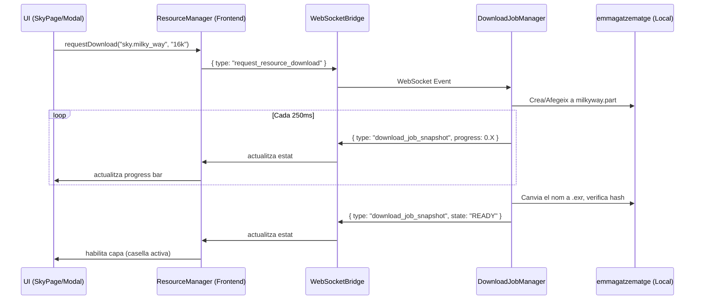

# Pas 23 — Capes, datasets, assistent de dades, preferències i feedback

> Estat: **pendent, amb implementació parcial**  
> El gestor de capes està en desenvolupament i disposa de l’arquitectura annexada, però la vertical encara no és completa.

## Resultat funcional palpable

L’aplicació disposa d’un gestor de capes i recursos equivalent: instal·lació, fonts externes, progrés, cancel·lació, fallback, visibilitat i restauració de preferències.

## Fonts TerraLab a consultar

- `TerraLab/data/layer_manager.py`
- `TerraLab/data/assets_manager.py` i `data/assets/*`
- `TerraLab/data/source_catalog.py`
- `TerraLab/ui/asset_onboarding.py` o assistent equivalent
- `TerraLab/common/utils.py` i configuració
- `TerraLab/ui/widget_controls_builder.py` — badges i progrés

## Objectiu

Completar aquesta vertical funcional de punta a punta, mantenint la separació de responsabilitats i sense anticipar funcionalitats posteriors que no siguin imprescindibles.

## Tasques

- [ ] Definir els IDs de capa i descriptors de cel/terra amb fills del sistema solar.
- [ ] Separar visibilitat de disponibilitat de dades.
- [ ] Definir estats ready, partial, missing, invalid, planned, downloading, paused, extracting i error.
- [ ] Definir manifests amb versió, mida, checksum, llicència, procedència i requisit.
- [ ] Implementar biblioteca de dades configurable i estructura de directoris.
- [ ] Implementar fonts administrades i fonts externes sense assumir-ne propietat.
- [ ] Implementar descàrrega reprenable, pausa, cancel·lació i instal·lació atòmica.
- [ ] Implementar checksum i validació després d’instal·lar.
- [ ] Implementar selecció automàtica/manual de font i fallback.
- [ ] Crear assistent funcional de dades i capes.
- [ ] Mostrar progrés Gaia, terreny, Via Làctia, Planck, NGC i altres recursos.
- [ ] Mostrar badges de fallback amb estabilització anti-flicker.
- [ ] Persistir visibilitat de capes, ubicació, Bortle, terreny, superfície, scope i estils.
- [ ] Versionar l’esquema de preferències i implementar migracions.
- [ ] Restaurar sessió sense iniciar descàrregues automàtiques no sol·licitades.
- [ ] Implementar errors accionables amb opció d’obrir l’assistent.
- [ ] Preservar pressupostos de caché per bytes i neteja segura.
- [ ] Comparar descriptors, defaults i fallbacks amb TerraLab.

## Criteri de sortida

Totes les capes de l’inventari es poden activar o expliquen exactament quin recurs falta; les descàrregues són controlables; les preferències i documents es restauren després de reiniciar.

## Evidència obligatòria

- [ ] Prova de biblioteca buida, parcial i completa.
- [ ] Prova de descàrrega pausada/cancel·lada/represa.
- [ ] Prova de checksum incorrecte.
- [ ] Round-trip de preferències i migració d’esquema.
- [ ] Vídeo de l’assistent i dels estats de capa.

## Fora d’abast del pas

El pas final endureix, mesura i homologa el conjunt complet.

## Annex: Arquitectura del gestor unificat de capes i recursos

Aquesta documentació detalla l'arquitectura del sistema encarregat d'obtenir, persistir i servir conjunts de dades asíncrons per a TerraLab3D. L'objectiu és independitzar la interfície gràfica de la complexitat del sistema d'arxius, errors de xarxa i reintents.

### 1. Conceptes clau: capa, recurs i descàrrega (tasca)

- **Capa (Layer)**: Un element visual en l'escena 3D (ex: Via Làctia, Anells de Saturn). Té un cicle de vida lligat a Three.js i respon a interaccions de visibilitat o opacitat.
- **Recurs (Resource)**: El conjunt de dades subjacent que fa possible la capa (ex: una textura EXR 16K o un fitxer BSP). A vegades, diverses capes poden compartir un mateix recurs.
- **Descàrrega (Job)**: L'acció asíncrona d'obtenir el recurs per la xarxa.

### 2. Arquitectura (Protocol UI ↔ Backend)



### 3. Estats del cicle de vida d'un Recurs

Els estats estan enumerats a `ResourceInstallState`:
- `NOT_INSTALLED`: Recurs inexistent al disc o corrupte.
- `DOWNLOADING`: Descarregant via HTTP (suporta streams i `Range`).
- `PAUSED`: L'usuari (o un error) ha aturat el flux. Es pot reprendre sense perdre els bytes descarregats.
- `VERIFYING`: Fent comprovació criptogràfica (MD5/SHA256) contra el manifest.
- `ERROR`: Problema insalvable (connexió refusada, HTTP 404).
- `PARTIAL`: (Per a bundles) Alguns fitxers existeixen però no la totalitat.
- `READY`: Descarregat, validat i disponible per muntar a memòria.

### 4. Variants i Bundles

- **Variants**: Versions mútuament exclusives d'un mateix concepte per ajustar-se a la capacitat gràfica de l'usuari. Ex: Via Làctia pot tenir variants de `8k`, `16k`, `32k`. 
- **Bundles (Fitxers Múltiples)**: A vegades un sol recurs requereix descarregar múltiples arxius per funcionar (ex: texturitzat de Mart amb albedo, relleu i normals per separat, o col·lecció de satèl·lits de Júpiter). Si algun fitxer falta, l'estat global es considera `PARTIAL`.

### 5. Emmagatzematge (emmagatzematge) i Migració

La persistència de dades es guarda de forma desacoblada del repositori git, concretament a:
`TerraLab3D/data/sky/managed` i `TerraLab3D/state/resources/`.

L'estat instal·lat es guarda a `local_installation_state.json`. Utilitzem rutes relatives al *data root* per permetre que un usuari mogui la carpeta global lliurement sense trencar referències.

#### Migració automàtica i Detecció
En arrencar, el component `ResourceInstallationRepository` escaneja directoris _legacy_ a la recerca de fitxers vàlids (ex. kernels antics). Si els troba, actualitza l'estat local a `READY` directament, evitant descarregar el que l'usuari ja havia obtingut.

### 6. Flux de reintent i Cancel·lació

En cas d'una caiguda de xarxa, el sistema marca el job com a `ERROR`. Si l'usuari clica a "Reintentar" (que internament crida de nou `request_resource_download`), el gestor examina el fitxer parcial (ex: `milkyway.exr.part`) al directori temporal, i si el proveïdor admet `Range: bytes=...`, reprendrà el byte des d'on ho va deixar.
Si l'usuari cancel·la o elimina el recurs des del gestor de capes, s'esborren tant els recursos temporals com els definitius associats i es retorna l'estat a `NOT_INSTALLED`.

### 7. Afegir un nou recurs

Afegir un recurs nou **no requereix modificar la lògica asíncrona ni la UI**. Simplement, s'ha d'afegir el descriptor al fitxer estàtic del backend (o carregar-lo des d'un manifest JSON). 

Exemple de descriptor afegit a la llista del `ResourceCatalog`:
```python
ResourceDescriptor(
    id="celestial.ngc",
    title="OpenNGC (Galàxies i Nebuloses)",
    provider="Mattia Verga / OpenNGC",
    acquisition_kind=AcquisitionKind.STATIC_FILE,
    variants=[
        ResourceVariant(
            id="default",
            title="Catàleg complet NGC/IC",
            source_url="https://raw.githubusercontent.com/mattiaverga/OpenNGC/master/NGC.csv",
            expected_bytes=1500000
        )
    ]
)
```
Amb això, apareixerà instantàniament al `ResourceManagerModal` per ser descarregat, posat en pausa, i reportar errors sota la mateixa capa de validació.
