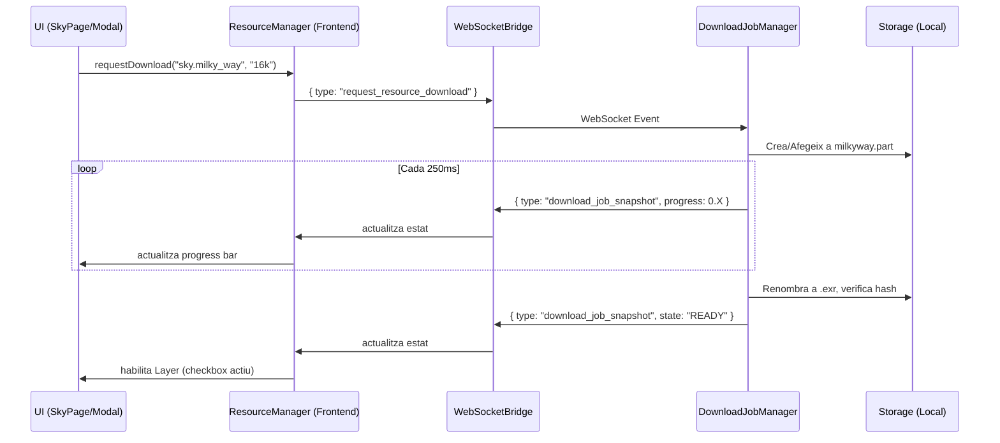

# Gestor Unificat de Capes i Recursos (TerraLab3D)

Aquesta documentació detalla l'arquitectura del sistema encarregat d'obtenir, persistir i servir conjunts de dades asíncrons per a TerraLab3D. L'objectiu és independitzar la interfície gràfica de la complexitat del sistema d'arxius, errors de xarxa i reintents.

## 1. Conceptes Clau: Capa vs Recurs vs Descàrrega (Job)

- **Capa (Layer)**: Un element visual en l'escena 3D (ex: Via Làctia, Anells de Saturn). Té un cicle de vida lligat a Three.js i respon a interaccions de visibilitat o opacitat.
- **Recurs (Resource)**: El conjunt de dades subjacent que fa possible la capa (ex: una textura EXR 16K o un fitxer BSP). A vegades, diverses capes poden compartir un mateix recurs.
- **Descàrrega (Job)**: L'acció asíncrona d'obtenir el recurs per la xarxa.

## 2. Arquitectura (Protocol UI ↔ Backend)



## 3. Estats de Vida d'un Recurs

Els estats estan enumerats a `ResourceInstallState`:
- `NOT_INSTALLED`: Recurs inexistent al disc o corrupte.
- `QUEUED`: Petició acceptada, encara sense transferència de dades.
- `AUTHENTICATING`: Esperant una sessió vàlida del proveïdor; encara no s'estan rebent bytes.
- `DOWNLOADING`: Descarregant via HTTP (suporta streams i `Range`).
- `PAUSED`: L'usuari (o un error) ha aturat el flux. Es pot reprendre sense perdre els bytes descarregats.
- `VERIFYING`: Fent check criptogràfic (MD5/SHA256) contra el manifest.
- `PROCESSING`: Generant els derivats locals després de verificar la descàrrega.
- `ERROR`: Problema insalvable (connexió refusada, HTTP 404).
- `PARTIAL`: (Per a bundles) Alguns fitxers existeixen però no la totalitat.
- `READY`: Descarregat, validat i disponible per muntar a memòria.

## 4. Variants i Bundles

- **Variants**: Versions mútuament exclusives d'un mateix concepte per ajustar-se a la capacitat gràfica de l'usuari. Ex: Via Làctia pot tenir variants de `8k`, `16k`, `32k`. 
- **Bundles (Fitxers Múltiples)**: A vegades un sol recurs requereix descarregar múltiples arxius per funcionar (ex: texturitzat de Mart amb albedo, relleu i normals per separat, o col·lecció de satèl·lits de Júpiter). Si algun fitxer falta, l'estat global es considera `PARTIAL`.

## 5. Emmagatzematge (Storage) i Migració

La persistència de dades es guarda de forma desacoblada del repositori git, concretament a:
`TerraLab3D/data/sky/managed` i `TerraLab3D/state/resources/`.

L'estat instal·lat es guarda a `local_installation_state.json`. Utilitzem rutes relatives al *data root* per permetre que un usuari mogui la carpeta global lliurement sense trencar referències.

### Migració automàtica i Detecció
En arrancar, el component `ResourceInstallationRepository` escaneja directoris _legacy_ a la recerca de fitxers vàlids (ex. kernels antics). Si els troba, actualitza l'estat local a `READY` directament, evitant descarregar el que l'usuari ja havia obtingut.

## 6. Flux de Retry i Cancel·lació

En cas d'una caiguda de xarxa, el sistema marca el job com a `ERROR`. Si l'usuari clica a "Reintentar" (que internament crida de nou `request_resource_download`), el gestor examina el fitxer parcial (ex: `milkyway.exr.part`) al directori temporal, i si el proveïdor admet `Range: bytes=...`, reprendrà el byte des d'on ho va deixar.
Si l'usuari cancel·la o elimina el recurs des del gestor de capes, s'esborren tant els recursos temporals com els definitius associats i es retorna l'estat a `NOT_INSTALLED`.

## 7. Afegir un nou recurs

Afegir un recurs nou **no requereix modificar la lògica asíncrona ni la UI**. Simplement, s'ha d'afegir el descriptor al fitxer estàtic del backend (o carregar-lo des d'un manifest JSON). 

Exemple de descriptor afegit a la llista del `ResourceCatalog`:
```python
ResourceDescriptor(
    id="celestial.ngc",
    title="OpenNGC (Galàxies i Nebuloses)",
    provider="Mattia Verga / OpenNGC",
    acquisition_kind=AcquisitionKind.STATIC_FILE,
    variants=[
        ResourceVariant(
            id="default",
            title="Catàleg complet NGC/IC",
            source_url="https://raw.githubusercontent.com/mattiaverga/OpenNGC/master/NGC.csv",
            expected_bytes=1500000
        )
    ]
)
```
Amb això, apareixerà instantàniament al `ResourceManagerModal` per ser descarregat, posat en pausa, i reportar errors sota la mateixa capa de validació.

## 8. Importació raster local d'elevació

La importació local és una operació diferent d'una descàrrega. No crea cap `DownloadJob` i separa tres documents:

- `layers.json`: descriptor publicable del recurs;
- `local_installation_state.json`: disponibilitat i propietat local;
- `data_sources.json`: font raster, ordre primària/fallback i selecció activa.

El frontend usa sessions HTTP correlacionades (`POST`, `PUT` binari, `inspect`, `commit`, `DELETE`). Els bundles gestionats es mantenen en staging fins al commit; cancel·lar-los no modifica els catàlegs. Les fonts externes només es registren i mai s'eliminen del disc. Després del commit, el `ReloadableElevationPort` canvia d'adaptador de manera atòmica, conserva lectures en curs i força un nou fingerprint de terreny i horitzó.

La pestanya TERRA queda dividida en `Elevació`, `Categòric` i `Refinament`. La contaminació lumínica existent viu a `Refinament`.

## 9. Importació raster categòrica i esquemes TLST

`Categòric → + Importar` reutilitza les mateixes sessions HTTP locals i els
mateixos modes `managed`/`external`, però analitza valors discrets sense
interpolació. Admet una banda entera, índex amb paleta i colors RGB/RGBA
exactes. El fitxer font es conserva i només es genera una vista indexada
`uint16` reconstruïble per als hot paths actuals.

TerraLab proposa coincidències del registre només després que la font s'ha
declarat categòrica. L'usuari ha de revisar i confirmar esquema, versió i
revisió. El registre incorpora S2GLC, WorldCover, Copernicus LCM-10, CORINE i
els esquemes personals persistits a `classification_schemes.json`. Un mapping
personal pot apuntar a qualsevol node TLST; no cal inventar una fulla.

Després del commit, `data_sources.json` conserva el valor i dtype font,
l'encoding, les bandes, la revisió i el raster derivat. El canvi retira els
tiles categòrics obsolets i torna a publicar llegenda i cobertura. El picking
continua mostrant el valor font real, no el codi compacte d'execució quan són
diferents.

## 10. Refinaments TLST

`TERRA → Refinament` és una capacitat vertical del mateix gestor. Defineix una
AOI en un mapa OpenLayers autònom, consulta tots els adaptadors habilitats,
calcula cobertura local/planificada/pendent i congela els assets seleccionats en
un pla paramètric reproduïble. Els jobs reutilitzen pausa, represa, verificació i
cancel·lació del `DownloadJobManager`; el progrés tècnic es tradueix a missatges
de refinament sense crear un segon motor de descàrregues.

La descàrrega no es considera instal·lada fins que el postprocessador ha traduït
les classes a TLST, les ha alineat a la graella canònica, ha actualitzat el
mosaic incremental i ha calculat cobertura des dels píxels vàlids. La importació
manual iniciada des d'un node segueix el mateix principi i exigeix metadades de
llicència comercial abans de registrar cobertura verificada.

La matriu actual de productes, llicències, proveïdors desactivats i buits de
cobertura es manté a [tlst-refinement-manager.md](tlst-refinement-manager.md).
